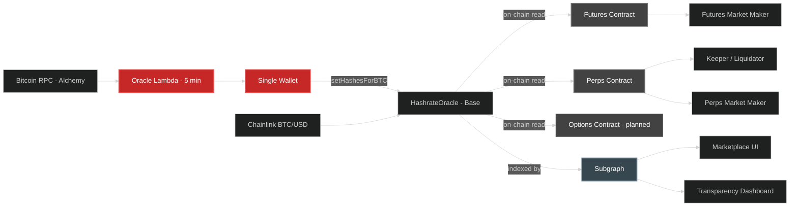
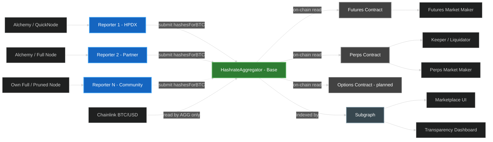

# Decentralizing the Hashpower Index: Executive Summary

> **Status**: Draft — for team review and stakeholder distribution
> **Created**: April 8, 2026
> **Context**: HPDX (Hashpower Derivatives Exchange) — futures, perps, options

---

## The Problem

The Hashpower Index ("hashprice") is the foundational price feed for the entire HPDX marketplace. It represents the USDC-equivalent value of **100 TH/s of Bitcoin mining hashpower per day**. Today, this value is computed by a single AWS Lambda function every 5 minutes and written on-chain via a single privileged wallet.

**One Lambda, one wallet, one entity controls the value that underpins all of HPDX.**

This creates risk across every dimension: a compromised wallet means an attacker writes arbitrary hashprices, a single infrastructure failure means stale data, and the market has no independent verification that the index is computed honestly.

### Current Architecture

**Red = centralized chokepoints.** Everything to the left of the HashrateOracle is centralized. Everything to the right is already decentralized or standard infrastructure. The target is clear: replace the single-writer pipeline with multi-party consensus.

### Future Architecture (OCMRO)

**Blue = independent reporters. Green = decentralized consensus.** Multiple reporters submit raw `hashesForBTC` values to the **custom-built, in-house** OCMRO contract (shown here as HashrateAggregator), which computes the median on-chain. The right side is unchanged — consumers point to a new contract address, same interfaces.

---

## The Direction

> ### **ON-CHAIN MULTI-REPORTER ORACLE (OCMRO)**
> *Custom-built. In-house. Deviation-triggered aggregation.*

After evaluating Chainlink CRE, Chainlink Functions, Chainlink Flux Aggregator (community node operators), Pyth Network, Tellor, UMA, RedStone, DIA, and API3, the recommendation is **OCMRO** (On-Chain Multi-Reporter Oracle).

A **custom-built, in-house** on-chain smart contract that accepts submissions from multiple independent reporter nodes, computes a median consensus, and serves the aggregated value to all downstream consumers via the same interfaces they use today. OCMRO is **not** a Chainlink product or a Chainlink "option"; it is our own design chosen after comparing vendor and protocol approaches.

**Relationship to Chainlink:** OCMRO **consumes** Chainlink's published BTC/USD price feed on-chain as an input to the hashprice formula, and **implements** Chainlink's `AggregatorV3Interface` so consumers stay wire-compatible. That is the full extent of the integration: **no** Chainlink-managed infrastructure, **no** Chainlink node operators, and **no** LINK tokens.

### At a Glance

| | **OCMRO** | **CL Flux** | **CL Functions** | **CL CRE** | **Pyth** |
|---|:---:|:---:|:---:|:---:|:---:|
| **Verdict** | **Recommended** | Heavy infra per node | Most expensive | Unpublished pricing | **Non-starter** (data model mismatch) |
| **Custom-built, in-house** | Yes | No | No | No | |
| **Community can contribute** | Yes — Docker | No — CL node ops only | No | No | |
| **Data source control** | Full | Full | Partial (multiplied API bills) | None (DON's own infra) | |
| **LINK tokens required** | No | Yes | Yes | Yes | |
| **Monthly cost (5-min updates)** | ~$6-30 gas | ~$6-30 gas + LINK/operator | ~$460-530 | Unknown (Early Access) | |
| **HPOW incentive path** | Yes | No (LINK only) | No | No | |
| **Time to production** | Weeks | Months (operator recruitment) | Weeks (GA) | Months (Early Access) | |
| **Preserves future optionality** | Yes — `AggregatorV3Interface` | Yes | No (locked to DON) | No (locked to DON) | |

### Why OCMRO — Unambiguously

**1. The data is deterministic — this is the single most important factor.**

The hashprice formula gives the same answer for everyone given the same Bitcoin block height. Multiple reporters don't improve price discovery — they prevent manipulation. OCMRO's on-chain individual submissions are the ideal transparency model: every reporter's value is a distinct public transaction anyone can audit.

**2. Zero dependency = zero blockers.**

No LINK tokens, no Workflow Registry, no CRE API keys, no WASM compilation, no unknown per-execution pricing. Just a Solidity contract, a Docker image, and wallets. Testnet in weeks, not months.

**3. Community participation is only viable through Docker.**

External contributors can't participate in Chainlink DON consensus (closed node set) or Flux Aggregator feeds (full CL node infra required). Docker is the only realistic path to community reporters: `docker run` + env vars = running reporter.

**4. Base chain makes OCR's gas advantage irrelevant.**

On Base at $0.002-0.01 per transaction, 10 reporters submitting individually costs ~$0.02-0.10 per round. The LINK premium alone on any Chainlink option would exceed this.

**5. Starting with OCMRO preserves all optionality.**

Because OCMRO exposes `AggregatorV3Interface`, adding CRE or Functions as a reporter later (hybrid model) or migrating entirely is additive — not a rewrite. No doors close by starting here.

### Other Options Considered

**Chainlink CRE** — Full workflow orchestration on Chainlink's DON. Deployment is still Early Access, per-execution LINK pricing is unpublished, DON nodes use Chainlink's own infrastructure (you lose control of which Bitcoin data source is used), and there is zero path for community participation. The only argument for CRE-first is brand recognition — but self-managed CRE feeds don't even appear in Chainlink's official feed catalog.

**Chainlink Functions** — Serverless JavaScript on the DON with transparent pricing ($0.03/request). GA on Base and simpler than CRE, but the most expensive option at ~$460-530/month for 5-minute updates. Each DON node independently hits your API endpoints (multiplied bills), execution is constrained to 10 seconds and 5 HTTP calls, and — like CRE — there is no community participation path.

**Chainlink Flux Aggregator** — Legacy on-chain aggregation protocol (superseded by OCR). Architecturally similar to OCMRO, but each participant must run full Chainlink node infrastructure (Go binary + PostgreSQL + Ethereum client), operators are found via Discord negotiation, compensation is in LINK not HPOW, and the "community" is professional Chainlink node operators — not your HPDX users or partners.

**Pyth Network** — Non-starter. Pyth aggregates diverse *observed market prices* from exchanges and trading firms. The hashprice is a *deterministic formula* with no diversity of observation. Pyth's publisher model explicitly requires publishers' own first-party data generated through their business operations — a formula anyone can compute against any Bitcoin node isn't anyone's first-party data. Beyond the data model mismatch, Pyth's pull-based architecture would require material changes to every consumer.

---

## Companion Documents

| Document | Purpose |
|----------|---------|
| [Oracle Decentralization Options](01-architecture-options.md) | Full architecture analysis: current/future architecture, design criteria, all options evaluated, conceptual architecture, dependency model |
| [Deep Dive Comparison](02-deep-dive-comparison.md) | OCMRO vs Flux Aggregator vs Functions vs CRE: infrastructure, dependencies, costs, contributor requirements, pressure test |
| [Pyth Option Analysis](03-pyth-analysis.md) | Why Pyth doesn't fit: data model mismatch, publisher requirements, pull-based architecture, migration effort |
| [Contract & Consumer Reference](04-contract-reference.md) | Technical detail: contract interfaces, consumer compatibility, submit flow, adjustable parameters |
| [Monitoring & Observability](05-monitoring-design.md) | Events, subgraph extension, dashboard, alerting |
