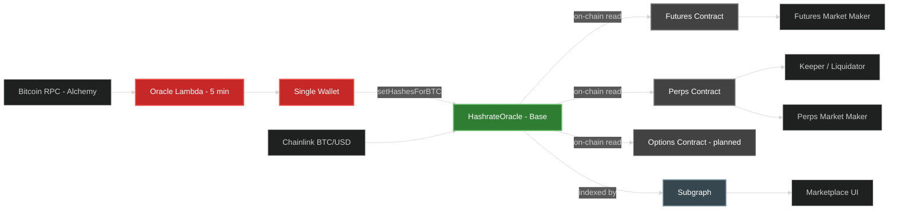
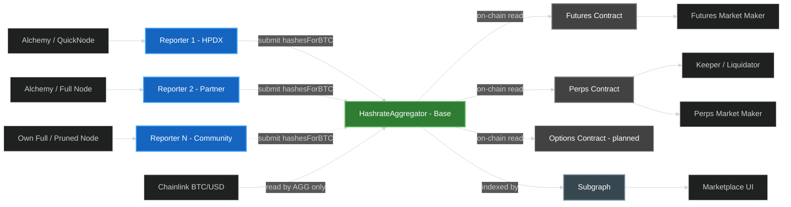
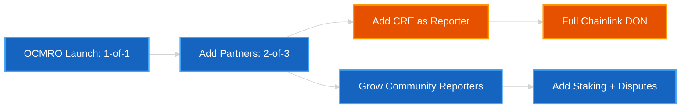
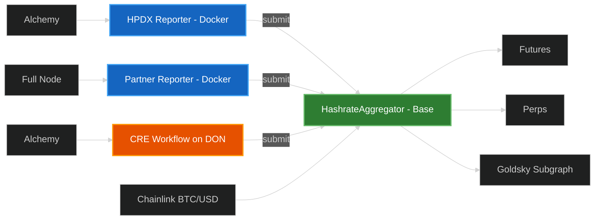
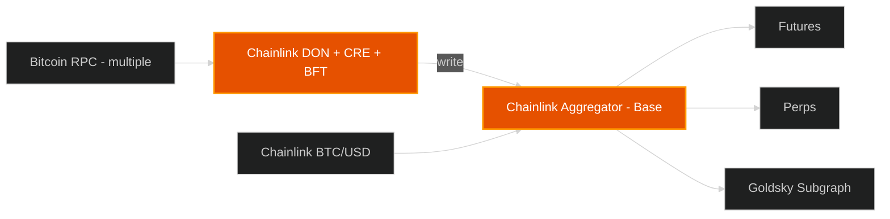
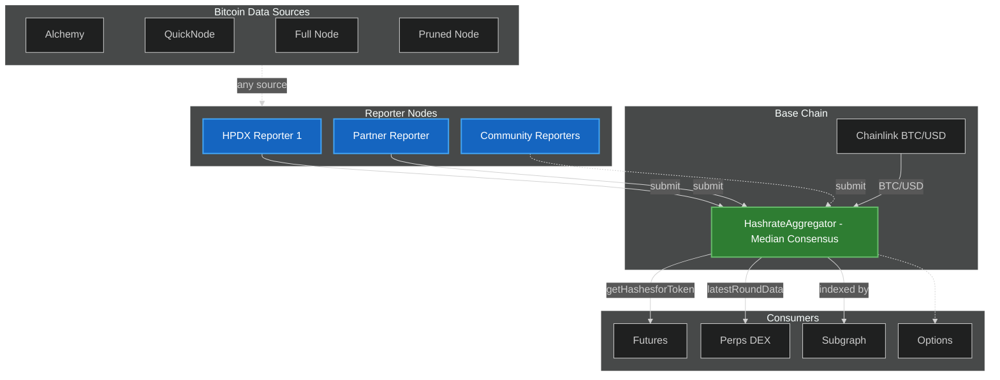

# Decentralizing the Hashpower Index Oracle

> **Status**: Draft — for team review
> **Created**: April 8, 2026
> **Context**: HPDX (Hashpower Derivatives Exchange) — futures, perps, options
> **Executive Summary**: [Executive Summary](00-executive-summary.md)
> **Companion docs**: [Deep Dive Comparison](02-deep-dive-comparison.md) · [Pyth Option Analysis](03-pyth-analysis.md) · [Contract & Consumer Reference](04-contract-reference.md) · [Monitoring & Observability](05-monitoring-design.md)

---

## 1. TL;DR

The Hashpower Index ("hashprice") is the foundational price feed for the entire HPDX marketplace — futures, perpetuals, and the upcoming options market. It represents the USDC-equivalent value of **100 TH/s of Bitcoin mining hashpower per day** (confirmed in the contract: `description()` returns `"The price of 100 TH/s per day in USDC"`). Today, a single AWS Lambda function computes this value every 5 minutes and writes it on-chain via a single privileged wallet.

**This document proposes replacing the single-writer oracle with an on-chain multi-reporter oracle (OCMRO)** — an on-chain smart contract that accepts submissions from multiple independent reporter nodes, computes a median consensus, and serves the aggregated value to all downstream consumers via the same interfaces they use today.

### Direction

The recommended approach is **OCMRO with deviation-triggered aggregation** — the **custom-built, in-house** design. OCMRO is a fully on-chain, transparent aggregation contract where every reporter submission is a public transaction, the median logic is immutable and auditable, and no off-chain processing sits between reporters and the published value. It **consumes** Chainlink's BTC/USD price feed as an on-chain input and **implements** `AggregatorV3Interface` for consumer compatibility, but it uses **no** Chainlink infrastructure, oracle nodes, or LINK tokens.

**Chainlink CRE** is a separate, **protocol-dependent** maturation path — OCMRO's `AggregatorV3Interface` output means adopting CRE later is additive, not a rewrite for consumers.

**Pyth Network** was evaluated as a potential future option. See the [Pyth Option Analysis](03-pyth-analysis.md) companion doc for a detailed assessment. It was determined that Pyth is not a good fit for the hashprice oracle because it is designed to aggregate diverse market observations, while the hashprice is a deterministic formula with no diversity of observation.

OCMRO, Chainlink Flux Aggregator, Chainlink Functions, Chainlink CRE, and side-by-side infrastructure comparisons are explored in the [Deep Dive Comparison](02-deep-dive-comparison.md) companion doc.

---

## 2. Background

### 2.1 What Is the Hashpower Index?

The hashpower index (hashprice) answers: **"What is the USDC value of 100 TH/s of Bitcoin mining hashpower for one day?"**

It is derived from two inputs:
- **`hashesForBTC`** — computed from Bitcoin blockchain data (network difficulty, block transaction fees averaged over 144 blocks, current block subsidy). This is deterministic given the same block height.
- **BTC/USD price** — sourced from Chainlink's decentralized aggregator (already decentralized).

The on-chain contract composes these:

```
hashprice = (HASHES_PER_100THS_PER_DAY × btcPrice × scaling) / hashesForBTC
```

**Key property**: Given the same Bitcoin block height, any party running the open-source algorithm against any Bitcoin full node (or RPC provider) will arrive at the same `hashesForBTC` value. The calculation is **deterministic and publicly verifiable**.

### 2.2 Current Architecture



**Red = centralized chokepoints.** One Lambda, one wallet, one entity controls the value that underpins the entire HPDX marketplace.

**Consumer layers:**
- **Dark gray = on-chain contracts** (Futures, Perps, Options) — read the oracle directly via contract calls
- **Market Makers and Keeper** — interact with their respective derivative contracts (which internally read the oracle)
- **Subgraph** — indexes oracle data, serves historical time-series to the Marketplace UI and Transparency Dashboard

### 2.3 Future Architecture (OCMRO)



**Green = decentralized consensus.** Multiple independent reporters submit raw `hashesForBTC` values. The aggregator computes the median and composes with the Chainlink BTC/USD feed (which only the contract reads — reporters never touch BTC/USD). Every submission is a public on-chain transaction.

**Right side is unchanged from 2.2** — the consumer architecture stays the same. On-chain contracts read the oracle directly, market makers and keepers interact with their respective derivative contracts, and the Subgraph feeds the UI and dashboard. The only change is the contract address consumers point to.

### 2.4 Centralization Risks (Current)

| Risk | Impact |
|------|--------|
| Lambda wallet compromise | Attacker writes arbitrary hashprice |
| Algorithm manipulation | Single executor could skew the index |
| Single point of failure | Lambda or RPC outage → stale data |
| Infrastructure control | AWS account owner has full control |
| Data source monopoly | Single Bitcoin RPC endpoint (Alchemy) |

### 2.5 What's Already Decentralized

- **BTC/USD price**: Chainlink decentralized aggregator (`btcTokenOracle`)
- **Algorithm**: Open-source in `oracle-update/`
- **Contract interface**: Implements `AggregatorV3Interface`
- **Subgraph indexer**: Open-source, deployed on Goldsky

### 2.6 The Decentralization Target

The single centralized chokepoint: **who computes `hashesForBTC` and who writes it on-chain**. Today = one Lambda, one wallet, one entity. Replace with: N independent operators, on-chain median consensus, transparent and auditable.

### 2.7 Why Multiple Reporters for Deterministic Data?

The hashprice formula is deterministic — given the same Bitcoin block height, every reporter running the open-source algorithm against any Bitcoin node gets the same answer. So why have multiple reporters at all?

**Multiple reporters don't improve price discovery — they prevent manipulation.** Unlike market price oracles (Pyth, Chainlink BTC/USD) where aggregation finds the best consensus from legitimately diverse observations, OCMRO reporters for hashprice serve a fundamentally different purpose:

1. **Manipulation resistance** — if one reporter is compromised or tampered with, the median of N honest reporters still produces the correct answer. This is a Byzantine fault tolerance mechanism, not a price discovery mechanism.
2. **Availability** — if one reporter's infrastructure goes down (RPC outage, cloud failure), the feed stays live.
3. **Trust claim** — independent parties can verify the published value matches their own computation. "Don't trust us, run it yourself" only works if others are actually running it.

**What causes legitimate deviations between honest reporters?**

The formula inputs are `difficulty`, `block subsidy`, and `144-block average fees`:

| Input | Volatility | Can reporters disagree? |
|-------|-----------|------------------------|
| Difficulty | Changes every 2016 blocks (~2 weeks) | Only at an adjustment boundary if reporters see different block heights |
| Block subsidy | Changes every ~4 years (halving) | Essentially never |
| 144-block fee average | Shifts every block | Yes — the primary source of small deviations |

The main cause of deviation is the **block height race condition**: reporters poll at slightly different moments and may see different latest blocks. This shifts the 144-block fee window by one position, but adding or removing one block from a 144-block average produces negligible change. RPC propagation delay (Alchemy sees a new block seconds before a self-hosted node) amplifies this slightly.

In practice, deviations between honest reporters are vanishingly small — well below the 0.5% submission deviation threshold. The only time meaningful divergence occurs is at a difficulty adjustment boundary (~every 2 weeks) if reporters straddle that exact block, and even then it corrects within one polling cycle.

**The median doesn't find a better answer; it ensures the honest answer survives a bad actor.**

---

## 3. Design Criteria and Assumptions

### 3.1 Requirements

| Criterion | Requirement |
|-----------|-------------|
| Update cadence | 5 minutes |
| Interface compatibility | Drop-in replacement for current HashrateOracle |
| On-chain aggregation | All submissions and aggregation visible on-chain |
| Bootstrappable | Must work with 1 operator on day one |
| Adjustable parameters | Quorum, thresholds, reporter set configurable without redeployment |
| Self-service for contributors | Docker image + env vars = running reporter |

### 3.2 Assumptions

1. HPDX operates 1 reporter at launch; path to add more via whitelist
2. Launch partners identified for fast-follow onboarding (2nd and 3rd reporters)
3. Bitcoin RPC via Alchemy for HPDX; contributors may use their own full nodes or any provider supporting `getblockstats`
4. Owner key starts as single wallet, documented path to multisig
5. Consumers migrate via `setOracle()` calls — no contract redeployments
6. Goldsky subgraph continues to index the oracle; pointed at new contract address
7. Contract undergoes AI-assisted audit initially, third-party audit follows

### 3.3 Future Potential Roadmap

Items explicitly deferred from the initial build but on the horizon:

- **HPOW token incentives** — emission-based rewards for reporter operators (requires tokenomics design)
- **Permissionless reporter access** — staking-based entry replacing the whitelist (requires slashing/dispute mechanism)
- **Chainlink CRE integration** — adding a CRE workflow as a reporter or full migration (see [Deep Dive Comparison](02-deep-dive-comparison.md))
- **Pyth feed listing** — pursuing a native Pyth hashprice feed at scale (see [Pyth Option Analysis](03-pyth-analysis.md))

Items evaluated and **rejected**:

- Off-chain P2P agreement — opaque aggregation contradicts transparency goal
- Commit-reveal anti-frontrunning — unnecessary for deterministic public data

---

## 4. Options Considered

| Option | Approach | Category |
|--------|----------|----------|
| **OCMRO** (4.1) | Custom contract + Docker reporters | **Custom-Built** — in-house; recommended launch path |
| **Chainlink Flux Aggregator** (4.2) | Chainlink's FluxAggregator + community node operators | **Chainlink + Community** — individual on-chain submissions via CL nodes |
| **Chainlink Functions** (4.3) | Serverless JavaScript on DON with OCR consensus | **Chainlink Serverless** — GA on Base, transparent pricing, no community participation |
| **Chainlink CRE** (4.4) | DON-managed workflow execution | **Chainlink Managed** — full workflow orchestration; deployment is Early Access |
| **Pyth Network** (4.6) | Pull-based oracle with publisher network | **Rejected** — data model mismatch |

### 4.1 On-Chain Multi-Reporter Oracle (OCMRO) — Custom-Built — RECOMMENDED

Deploy a custom on-chain aggregator contract that accepts submissions from multiple reporters, computes a median, and serves the result via standard interfaces.

**Chainlink relationship**: OCMRO **consumes** Chainlink's decentralized BTC/USD price feed as an on-chain input (same composition model as today). It **implements** `AggregatorV3Interface` so existing consumers remain compatible. There is **no** Chainlink infrastructure to operate, **no** Chainlink oracle nodes, and **no** LINK tokens — only reading the public BTC/USD aggregator already on Base. `AggregatorV3Interface` is a standard interface; implementing it does not imply running Chainlink software.

**Strengths:**

- Zero third-party dependency — no tokens, governance proposals, or partnerships required before launch
- Drop-in replacement — implements same `AggregatorV3Interface` + custom HashrateOracle functions; consumers change only a contract address
- Every submission is a public on-chain transaction — full transparency
- Lowest reporter overhead — Docker image + wallet; no oracle node software
- Full design control — aggregation logic tailored to hashprice-specific needs
- Path to full decentralization — whitelist → staking → permissionless

**Weaknesses:**

- No established brand recognition (no "Powered by Chainlink" badge)
- Security and correctness are HPDX's responsibility (mitigated by audit)
- Dispute/slashing mechanism must be built if desired (future phase)

For detailed infrastructure comparison, see the [Deep Dive Comparison](02-deep-dive-comparison.md).

### 4.2 Chainlink Flux Aggregator — Chainlink + Community — EVALUATED

Chainlink's `FluxAggregator` contract is their legacy on-chain aggregation protocol. It's architecturally similar to OCMRO: multiple independent node operators each submit individually on-chain, and the contract computes the median. The key difference is that the operators are professional Chainlink community node operators running full Chainlink node infrastructure.

**How it works:**
- HPDX deploys (or coordinates deployment of) a `FluxAggregator` contract on Base
- Recruits independent Chainlink community node operators (e.g., LinkWell Nodes, Matrixed.Link) via Chainlink Discord or direct outreach
- Each operator runs full Chainlink node software (Go binary + PostgreSQL + Ethereum client) with a "Flux Monitor" job configured for the hashprice data source
- Operators poll the data source and submit on deviation threshold or heartbeat — each submission is an individual on-chain transaction
- The FluxAggregator computes the median and exposes it via `AggregatorV3Interface`
- HPDX funds the contract with **LINK tokens** to compensate operators

**Strengths:**
- Chainlink brand — using their standard contract and node operator ecosystem
- Individual on-chain submissions — same transparency model as OCMRO
- Community node operators are independent third parties — not HPDX employees
- `AggregatorV3Interface` is native — zero interface changes for consumers

**Weaknesses:**
- **Per-operator infrastructure is heavy**: Each operator runs full Chainlink node software (Go binary), PostgreSQL database, and an Ethereum client. This is not a Docker one-liner — it's a professional infrastructure commitment. Your HPDX community can't easily participate.
- **LINK token dependency**: The FluxAggregator contract must be funded with LINK to pay operators. Ongoing token management.
- **Legacy protocol**: Flux Monitor has been superseded by OCR (Off-Chain Reporting) for all official Chainlink feeds. Chainlink's direction is CRE/OCR, not Flux Monitor. Finding operators willing to maintain custom Flux Monitor jobs in 2026 is swimming against the current.
- **Operator recruitment is manual**: No marketplace. You find operators on Chainlink Discord, negotiate requirements, and coordinate SLAs individually.
- **No path for YOUR community**: The "community" here is Chainlink's professional node operator network, not HPDX users or partners. A partner can't just `docker run` to participate — they'd need to run full Chainlink node infrastructure.
- **No HPOW incentive path**: Operators are paid in LINK, not HPOW. No mechanism to integrate your own token incentives.

**Net assessment**: Flux Aggregator does what OCMRO does — individual on-chain submissions, median aggregation, deviation-triggered — but with heavier per-operator infrastructure, LINK costs, a legacy protocol, and no path for HPDX community participation. It adds Chainlink brand at the cost of flexibility and simplicity.

### 4.3 Chainlink Functions — Chainlink Serverless — EVALUATED

Chainlink Functions is a serverless compute platform where your smart contract sends JavaScript source code to a DON for execution. Each node runs the code independently, the DON reaches OCR consensus on the return value, and the result is written back to your contract via callback. Functions is **GA on Base mainnet** with published pricing ($0.03 per request).

**How it works for hashprice:** A consumer contract on Base sends JavaScript that fetches Bitcoin blockchain data, computes `hashesForBTC`, and returns the result. Chainlink Automation triggers this every 5 minutes. The DON executes the JavaScript with BFT consensus and writes the result back via callback.

**Strengths:**

- GA on Base (not Early Access like CRE) — fastest path to production among Chainlink options
- Transparent, published pricing ($0.03/request on Base)
- You control data sources — your JavaScript specifies which Bitcoin RPC endpoints to call
- Same OCR consensus model as CRE and official Chainlink price feeds
- Simpler than CRE — JavaScript, not TypeScript→WASM; no Workflow Registry on Ethereum mainnet

**Weaknesses:**

- **Most expensive option with transparent pricing** — ~$460-530/mo at 5-min intervals (Functions + Automation + API costs); deviation-triggered reduces to ~$140-180/mo
- **No community participation** — same as CRE; DON is a closed set of Chainlink nodes
- **API bill amplification** — each DON node independently hits your Bitcoin RPC endpoints (multiplied API calls)
- **Execution constraints** — 10-second timeout, max 5 HTTP calls, 256-byte return value (sufficient for hashprice but limits future algorithm complexity)
- **Requires Chainlink Automation** for scheduling — adds a second Chainlink dependency and cost layer

For detailed infrastructure, costs, and service limits, see the [Deep Dive Comparison](02-deep-dive-comparison.md).

### 4.4 Chainlink CRE (Custom Data Feed) — Chainlink Managed — MATURATION PATH

Deploy a custom data feed using the Chainlink Runtime Environment (CRE). CRE workflows execute on Chainlink's existing Decentralized Oracle Networks (DONs) — you do **not** need to run your own Chainlink node.

**Strengths:**

- Industry-leading brand — "Chainlink-powered" carries significant trust in DeFi
- `AggregatorV3Interface` is native — zero interface changes
- CRE workflows execute on existing DONs with BFT consensus
- Base chain is supported (mainnet and Sepolia, from CRE v1.0.0+)

**Weaknesses:**

- LINK token costs on every execution cycle (payment abstraction available)
- CRE is relatively new; documentation evolving
- Contributors must understand CRE workflow development (higher barrier than Docker)
- Self-managed feeds are not listed in Chainlink's official feed catalog

For detailed infrastructure, costs, and contributor requirements, see the [Deep Dive Comparison](02-deep-dive-comparison.md).

### 4.5 Maturation Path: OCMRO → CRE

The custom-built and protocol-dependent approaches are **not mutually exclusive**. Because OCMRO implements `AggregatorV3Interface`, the path from OCMRO to CRE is a spectrum, not a rewrite:



**Starting with OCMRO does not foreclose Chainlink CRE.** A CRE workflow can submit to the OCMRO contract as just another reporter. If Chainlink CRE matures and the DON model proves valuable, the aggregator can eventually be replaced entirely by a Chainlink DON — with zero consumer contract changes.

#### 4.5.1 Hybrid OCMRO + CRE Architecture

In this scenario, the OCMRO contract remains the source of truth. Chainlink CRE is added as one of several reporters — the aggregator doesn't care whether a submission comes from a Docker container or a CRE workflow.



**Key point**: The CRE reporter is just another whitelisted address. The OCMRO contract handles aggregation. This gives you Chainlink brand association while retaining full control over the aggregation contract.

#### 4.5.2 End-State: Full Chainlink DON

In this scenario, the OCMRO is retired. A Chainlink DON runs the hashprice computation as a CRE workflow, reaches consensus among DON nodes using BFT, and writes the aggregated value to a Chainlink-managed aggregator contract (which natively implements `AggregatorV3Interface`).



**Trade-offs**: Maximum decentralization and brand trust, but HPDX gives up control over aggregation logic, pays LINK per cycle, and depends on Chainlink infrastructure availability. Consumer contracts need only an address change (same interface).

### 4.6 Evaluated and Rejected

| Option | Reason for Rejection |
|--------|---------------------|
| **Pyth Network** | Architectural mismatch: Pyth aggregates diverse *observed market prices* from exchanges/market makers; hashprice is a *deterministic formula* with no diversity of observation. Publisher model explicitly requires first-party trading data. Pull-based model requires consumer contract changes. See [Pyth Option Analysis](03-pyth-analysis.md) for full assessment. |
| **Tellor** | Dispute window latency conflicts with 5-minute update cadence. TRB token dependency. |
| **UMA Optimistic Oracle** | Liveness periods (30+ min) incompatible with 5-minute updates. |
| **RedStone** | Requires RedStone team engagement. SDK differs from `AggregatorV3Interface`. |
| **DIA** | Designed for exchange price data, not Bitcoin RPC-derived metrics. |
| **API3 (Airnode)** | First-party model doesn't solve multi-party consensus. |

### 4.7 Aggregation Patterns Considered

| Pattern | Description | Verdict |
|---------|-------------|---------|
| **1. Simple On-Chain Median** | Fixed rounds; reporters submit per round; contract computes median when quorum met | Viable — simplest, most transparent |
| **2. Deviation-Triggered** | Reporters submit only when value changes beyond threshold or heartbeat expires | **Selected** — gas-efficient; suited for hashprice |
| **3. Commit-Reveal** | Two-phase submission to prevent front-running | Rejected — unnecessary for deterministic public data |
| **4. Off-Chain Agreement** | P2P consensus off-chain, single on-chain tx | Rejected — opaque aggregation contradicts transparency goal |

**Selected: Pattern 2 (Deviation-Triggered) with Pattern 1 heartbeat fallback.** All aggregation is fully smart-contract driven — no off-chain aggregator node.

For cost implications of Pattern 1 vs Pattern 2, see the [Deep Dive Comparison](02-deep-dive-comparison.md).

---

## 5. Conceptual Architecture

### 5.1 Components



**Data source flexibility**: The Docker reporter image accepts any `BITCOIN_RPC_URL`. Operators choose their own source — managed RPC (Alchemy, QuickNode), a self-hosted full node, or even a pruned node (only needs the last ~144 blocks / ~1 day of data for `getblockstats`). A pruned node is ~10-20 GB vs ~700 GB for a full archival node. The dashed lines from data sources to reporters indicate that any reporter can connect to any source — the algorithm is the same regardless.

### 5.2 HashrateAggregator Contract (Summary)

The new contract replaces the current `HashrateOracle`. It exposes the same external interface so all existing consumers work with only an address change.

**Key capabilities:**
- Accepts `submit(hashesForBTC)` from whitelisted reporters
- Computes median of all fresh submissions when quorum is met
- Composes with Chainlink BTC/USD to produce the hashprice
- Exposes `latestRoundData()`, `getHashesForBTC()`, `getHashesforToken()`, and all other HashrateOracle functions

**Adjustable parameters** (owner-configurable, no redeployment):

| Parameter | Initial | Description |
|-----------|---------|-------------|
| `minSubmissions` | 1 → 2 → N | Minimum fresh submissions for consensus |
| `deviationThresholdBps` | 2000 (20%) | Circuit breaker for outlier rejection |
| `maxStaleness` | 900 (15 min) | Freshness window for submissions |
| `reporters` | Whitelist | Authorized reporter addresses |
| `owner` | Deployer | Transferable to multisig |

For detailed contract interface and consumer compatibility analysis, see [Contract & Consumer Reference](04-contract-reference.md).

### 5.3 Reporter Node (Docker Image)

Published to GHCR — open-source, inspectable, runnable by anyone.

**What a reporter does:**
1. Polls Bitcoin RPC every ~60 seconds
2. Computes `hashesForBTC` using the open-source algorithm
3. Submits to the aggregator only when deviation exceeds threshold or heartbeat expires

**Configuration:**

| Env Var | Description |
|---------|-------------|
| `BITCOIN_RPC_URL` | Alchemy, QuickNode, own full node, or pruned node |
| `BASE_RPC_URL` | Base chain RPC |
| `AGGREGATOR_ADDRESS` | HashrateAggregator contract |
| `REPORTER_PRIVATE_KEY` | Reporter wallet key |
| `DEVIATION_THRESHOLD_BPS` | Default: 50 (0.5%) |
| `HEARTBEAT_SECONDS` | Default: 300 (5 min) |

### 5.4 Consumer Migration

No contract redeployments required. Confirmed from code:

| Consumer | Migration Action | Code Change? |
|----------|-----------------|-------------|
| **Futures** | `setOracle(newAddr)` — owner tx | No |
| **Perps** | `setOracle(newAddr)` — owner tx | No |
| **Subgraph** | Update env var, redeploy | Possibly minor |
| **Margin-call Lambda** | Update tfvars | No |
| **Market Maker** | Update config | No |

For detailed consumer-by-consumer analysis and interface compatibility matrix, see [Contract & Consumer Reference](04-contract-reference.md).

---

## 6. Build and Launch

Three deliverables, built in parallel:

1. **HashrateAggregator contract** — deploy to testnet, audit, deploy to mainnet
2. **Reporter Docker image** — open-source, published via CI/CD to GHCR.io
3. **Consumer migration** — point existing contracts at the new aggregator address (owner tx, no code changes)

Launch is **1-of-1** (HPDX as sole reporter). The aggregator contract has built-in support for expanding the reporter whitelist and adjusting quorum — no redeployment needed to go from 1-of-1 to N-of-M.

---

## 7. References

### Companion Documents

| Document | Purpose |
|----------|---------|
| [Deep Dive Comparison](02-deep-dive-comparison.md) | OCMRO vs Flux Aggregator vs Functions vs CRE: infrastructure, costs, contributor requirements |
| [Pyth Option Analysis](03-pyth-analysis.md) | Pyth as a future maturation path |
| [Contract & Consumer Reference](04-contract-reference.md) | Detailed contract interfaces, consumer code analysis |
| [Monitoring & Observability](05-monitoring-design.md) | Events, subgraph extension, dashboard, alerting |

### Internal

| Resource | Path |
|----------|------|
| Current oracle contract | `contracts/contracts/HashrateOracle.sol` |
| Oracle updater (Lambda) | `oracle-update/` |
| Subgraph indexer | `indexer/` |
| Lambda infrastructure | `.bedrock/.terragrunt/05_oracle_lambda.tf` |

### External

| Resource | URL |
|----------|-----|
| Chainlink CRE Docs | https://docs.chain.link/cre |
| Chainlink CRE Supported Networks | https://docs.chain.link/cre/supported-networks-ts |
| Chainlink Functions Docs | https://docs.chain.link/chainlink-functions |
| Chainlink Functions Supported Networks | https://docs.chain.link/chainlink-functions/supported-networks |
| Pyth Developer Hub | https://docs.pyth.network/price-feeds |
| Base Chain Docs | https://docs.base.org/ |
