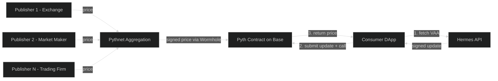

# Pyth Network Option Analysis

> **Status**: Draft — for team review
> **Parent**: [Oracle Decentralization Options](01-architecture-options.md)
> **Purpose**: Detailed assessment of Pyth Network as a potential maturation path,
> including migration effort from **OCMRO** (custom in-house oracle) or **Chainlink CRE**
> (protocol-dependent). **Pyth** is also protocol-dependent; neither Chainlink CRE nor Pyth should be
> conflated with OCMRO, which is HPDX-built rather than a Chainlink product.

---

## TL;DR

Pyth Network is a credible, well-funded oracle protocol with strong institutional backing and broad chain support (including Base). However, it has **fundamental mismatches** with the hashprice oracle use case:

1. **Fundamental data model mismatch** — Pyth is built for *observed market prices* (what did BTC/USD trade at on Coinbase?). The hashprice is a *computed index* derived deterministically from Bitcoin blockchain data (difficulty, fees, subsidy). These are architecturally different: market prices vary across venues and benefit from multi-source aggregation; the hashprice formula produces the same output for everyone given the same block height. Pyth's aggregation model adds no value to deterministic data.
2. **Publisher model requires *their own* first-party data** — Pyth's documentation explicitly states: *"Only data providers with first-party data (exchanges, market makers, and trading firms) are allowed to participate"* ([source](https://docs.pyth.network/price-feeds/core/publish-data)). "First-party" means data the publisher *generates through their own business operations* — a trade on Coinbase's order book is Coinbase's first-party data. The hashprice formula output isn't anyone's first-party data; it's a public computation anyone can run against any Bitcoin node. Even if HPDX market-makes on its own exchange, the data it would publish is the formula output, not a price observed through trading. Every publisher in Pyth's network (Cboe, Coinbase, Revolut, Virtu, Wintermute) provides data uniquely generated by their own operations — no precedent exists for a computed/derived index.
3. **Pull-based model** — requires all consumers to submit price update transactions before reading. Materially different from the push-based model HPDX uses today.
4. **DAO governance bottleneck** — adding a new feed requires a formal proposal (0.25% of staked PYTH to submit), 7-day discussion, 7-day vote. No guarantee of approval for a niche metric with no publisher precedent.
5. **Contract changes required** — even with the `PythAggregatorV3` adapter, migration involves deploying adapter contracts, running a "Price Pusher" service, and modifying consumer transaction patterns.

**Migration difficulty from in-house OCMRO or from Chainlink CRE to Pyth: HARD.** **The core issue is structural**: Pyth is designed to aggregate diverse market observations. The hashprice has no diversity of observation — it's a formula.

There may be reasons to reconsider Pyth in the future (§5), but it is not recommended as a near-term path.

---

## 1. How Pyth Works

### 1.1 Architecture Overview

Pyth is a **pull-based oracle** — fundamentally different from Chainlink-style push oracles and from **OCMRO**, HPDX's **custom-built, in-house** On-Chain Multi-Reporter Oracle (push-based aggregator + reporters, not a Chainlink offering).



**Key difference from push oracles**: The consumer must fetch a signed price update (VAA — Verified Action Approval) from Hermes (an off-chain API service) and submit it on-chain as part of their transaction. The Pyth contract verifies the signatures and Merkle proofs, then stores the price.

### 1.2 Data Publishers — Why This Doesn't Fit Hashprice

Pyth sources data from **first-party institutional participants** — exchanges, banks, market makers, and trading firms. As of April 2026, Pyth has 120+ publishers including Cboe Global Markets, Coinbase, Revolut, Virtu Financial, and Wintermute.

**Publisher requirements** (from [Pyth docs](https://docs.pyth.network/price-feeds/core/publish-data)):

> *"Only data providers with first-party data (exchanges, market makers, and trading
> firms) are allowed to participate in the network."*

- Entity must have **their own first-party data** — data they generate through their own trading, market-making, or exchange operations
- Must apply to the Pyth Data Association
- Must generate a Solana keypair for signing submissions
- Must run `pyth-agent` software + Pythnet validator infrastructure
- Must be approved by the Pyth DAO Price Feed Council

#### The Index vs. Observed Price Problem

Pyth's model works because multiple independent sources *naturally observe different prices*. Coinbase sees BTC/USD at $67,001 while Binance sees $67,003 — Pyth aggregates those diverse observations into a robust consensus with confidence intervals. The diversity of observation is the value.

**The hashprice doesn't have this property.** It's a deterministic formula:

```
hashesForBTC = (difficulty × 2^32) / (144-block avg fees + block subsidy)
```

Given the same Bitcoin block height, everyone running this formula against any Bitcoin node gets the *same answer*. There is no diversity of observation to aggregate — Pyth's multi-publisher aggregation model adds no value to deterministic data.

#### "But HPDX is a market maker on its own exchange..."

If HPDX market-makes on the hashpower derivatives exchange, it has first-party data about *what hashpower derivatives traded at*. But the oracle doesn't publish derivative prices — it publishes the underlying index. The formula output doesn't change based on what's trading on the exchange. And there's a circularity risk: the oracle drives the exchange, and the exchange activity would supposedly inform the oracle.

Even framed generously ("we operate the primary market for hashpower derivatives and have unique insight into fair value"), the data HPDX would publish to Pyth is still the blockchain-derived formula output, not an observed market price. No current Pyth publisher operates this way — every one provides data they directly observe through their core business activity (trading, market-making, or exchange operations).

### 1.3 Feed Creation

New feeds go through **Pyth DAO governance**:

1. **Proposal** — Requires holding ≥0.25% of staked PYTH to submit
2. **Discussion** — 7 days on the Pyth DAO forum
3. **Voting** — 7 days, 1:1 coin-weighted (staked PYTH), >50% for ordinary proposals
4. **Execution** — Price Feed Council oversees implementation

**No existing hashrate or mining-related feeds** in Pyth's catalog (confirmed via research — Pyth covers crypto, equities, FX, commodities, metals, rates, and economic indicators, but not mining metrics).

### 1.4 Base Chain Support

Pyth has a deployed price feeds contract on **Base mainnet**. The contract address is listed in the [Pyth Contract Addresses](https://docs.pyth.network/price-feeds/core/contract-addresses) documentation. Base is a fully supported network.

---

## 2. What Would Migration to Pyth Require?

### 2.1 Prerequisites

| Requirement | Detail | Feasibility |
|-------------|--------|-------------|
| Become a Pyth publisher | Apply to Pyth Data Association, get approved | **Uncertain** — HPDX derives data from Bitcoin blockchain, not from first-party trading |
| Get a hashprice feed approved | Submit DAO proposal, 7-day discussion, 7-day vote | **Uncertain** — niche metric, no precedent in Pyth catalog |
| Hold 0.25% staked PYTH | To submit governance proposal | Requires PYTH token acquisition |
| Run Pythnet infrastructure | `pyth-agent` + Pythnet validator | Additional infra to operate |
| Run Solana infrastructure | Solana RPC node (Pythnet is Solana-based) | Additional dependency |

### 2.2 Contract Changes

Even with Pyth's `PythAggregatorV3` adapter contract (which wraps Pyth feeds behind `AggregatorV3Interface`), material changes are needed:

| Consumer | Change Required |
|----------|----------------|
| **Perps DEX** | Deploy `PythAggregatorV3` adapter on Base for hashprice feed. Call `setOracle()` to point at adapter. Adapter reads from Pyth contract. |
| **Futures** | Futures uses `getHashesforToken()` — **not part of AggregatorV3Interface**. The Pyth adapter does NOT implement this. Would require either: (a) modifying `Futures.sol` to use `latestRoundData()` instead, or (b) building a custom adapter that translates. |
| **Subgraph** | Would need to index the Pyth contract or the adapter contract instead. Handler changes required — Pyth events differ from HashrateOracle events. |
| **All consumers** | Must ensure a "Price Pusher" service runs to keep the on-chain Pyth price fresh, since Pyth is pull-based. Without a pusher, the price goes stale between user transactions. |

### 2.3 The Pull-Model Problem

Today, the oracle is **push-based**: the Lambda (or OCMRO reporters) write data on-chain on a schedule. Consumers simply read it. No consumer needs to "trigger" an update.

With Pyth, someone must submit the price update on-chain before consumers can read fresh data. Options:

1. **Each consumer transaction includes the update**: The frontend or backend must fetch a VAA from Hermes and include it in the transaction calldata. This requires changes to every frontend and every off-chain service that interacts with the oracle.

2. **Run a "Price Pusher" service**: A cron service fetches from Hermes and pushes updates on-chain every N seconds. This is essentially re-introducing a centralized service similar to the Lambda — defeating the decentralization purpose.

3. **Use the `PythAggregatorV3` adapter**: The adapter can read the latest Pyth data, but the data must still have been recently pushed by someone. The adapter does not solve the freshness problem.

### 2.4 Migration Effort Assessment

| Starting Point | Migration to Pyth | Difficulty |
|---------------|-------------------|------------|
| **From OCMRO** | Deploy Pyth adapter, modify Futures contract (or build custom adapter for `getHashesforToken`), modify all frontends to include VAA in transactions OR run Price Pusher, get hashprice feed approved by Pyth DAO, become approved publisher, run Pythnet infrastructure | **Hard** |
| **From Chainlink CRE** | Same as above — Chainlink CRE consumer contract already uses AggregatorV3Interface, but still need Pyth-specific changes for pull model, Futures contract, and DAO approval | **Hard** |

**Rough effort breakdown:**

| Task | Effort |
|------|--------|
| Pyth DAO governance (proposal + vote) | 2-4 weeks minimum, uncertain outcome |
| Pyth publisher onboarding | Unknown timeline — depends on Data Association |
| Pythnet infrastructure setup | 1-2 weeks |
| `PythAggregatorV3` adapter deployment | 1-2 days |
| Futures contract modification | 1-2 weeks (contract change + audit + upgrade) |
| Frontend modifications (VAA inclusion) | 2-4 weeks across all frontends |
| OR Price Pusher service | 1 week to build, ongoing operation |
| Subgraph indexer changes | 1-2 weeks |
| Testing and burn-in | 2-4 weeks |
| **Total** | **2-4 months** (assuming DAO approval) |

---

## 3. Decentralization Comparison

**OCMRO** is the custom in-house path (HPDX-owned contracts and reporters). **Chainlink Flux Aggregator**, **Chainlink Functions**, **Chainlink CRE**, and **Pyth** are external/protocol-dependent options (see [Architecture Options](01-architecture-options.md) for the full evaluation). This section compares the primary candidates.

| Aspect | OCMRO (in-house) | Chainlink CRE | Pyth |
|--------|-------|-----|------|
| Who computes the value? | Independent reporter nodes | Chainlink DON | Pyth publishers (institutional) |
| Is the computation distributed? | Yes — N independent reporters | Yes — DON BFT consensus | Yes — M publishers, aggregated on Pythnet |
| Can HPDX be the sole operator? | Yes (1-of-1 at launch) | Yes (single CRE workflow) | **No** — must have approved publishers; single-publisher feeds may not be accepted |
| Can community members contribute? | Yes — Docker image, low barrier | Partially — CRE SDK knowledge required | **No** — only approved institutional publishers |
| On-chain transparency | Full — every submission visible | Partial — DON result visible | Partial — aggregated price visible, individual publisher data on Pythnet |
| Governance | Contract owner (HPDX → multisig) | HPDX controls workflow | **Pyth DAO** controls feed parameters, publisher set |
| Can HPDX unilaterally update? | Yes — UUPS proxy upgrade | Yes — workflow update | **No** — DAO governance for feed changes |

---

## 4. Cost Comparison

| Cost Category | OCMRO (in-house) | Chainlink CRE | Pyth |
|--------------|-------|-----|------|
| Token purchase | None | LINK (unknown per-execution) | PYTH (0.25% staked for proposals) |
| Infrastructure (HPDX) | Docker + Bitcoin RPC | CRE workflow | Pythnet validator + pyth-agent + Price Pusher |
| Infrastructure (contributor) | Docker + Bitcoin RPC | CRE SDK + LINK | N/A (publishers are institutional) |
| Gas (Base) | ~$3-30/mo (4 reporters, Pattern 2) | ~$3-30/mo + LINK | ~$3-30/mo (Price Pusher) |
| Ongoing governance | None (HPDX controls) | None (HPDX controls) | Must participate in Pyth DAO votes |

---

## 5. Why Consider Pyth in the Future?

Despite the challenges, there are scenarios where Pyth could become relevant:

### 5.1 If Hashprice Becomes a Widely-Demanded Feed

If multiple DeFi protocols begin demanding hashprice data (not just HPDX), the Pyth DAO might accept a feed proposal because the community would fund it. This shifts the economics — HPDX wouldn't be the only one advocating for the feed.

### 5.2 If Pyth Expands Beyond Market Price Data

Pyth's current publisher model is focused on "first-party" market data. If they expand to accept computed/derived metrics (like indices, hashrate, or blockchain-derived data), the publisher barrier would lower.

### 5.3 If Brand Recognition Becomes Critical

Pyth has strong brand recognition in DeFi, especially in the Solana ecosystem but increasingly in EVM. If external credibility becomes a material business need (e.g., institutional trading partners require a recognized oracle), Pyth could add value.

### 5.4 If HPDX Wants to Offload Oracle Maintenance

Once a Pyth feed exists and is maintained by the DAO with multiple publishers, HPDX would no longer need to operate oracle infrastructure. The feed would be maintained by the Pyth network — truly decentralized and externally governed.

### 5.5 Pyth's Confidence Intervals

Pyth includes **confidence intervals** with every price — a measure of data quality and agreement among publishers. This is a feature that OCMRO and Chainlink CRE do not natively provide. For a derivatives exchange, confidence intervals could be valuable for risk management (e.g., widening spreads when confidence is low).

---

## 6. Recommendation

**Pyth is not recommended as a near-term path** due to:
- No existing hashprice feed and uncertain DAO approval
- Publisher requirements that may exclude HPDX
- Pull-based model requiring material changes to all consumers
- Loss of unilateral control over feed parameters

**Pyth could become relevant** if the hashprice becomes a broadly demanded DeFi primitive, or if Pyth expands its publisher model beyond first-party market data.

**If we wanted to pursue Pyth later**, standardizing first on **OCMRO** (the in-house aggregator) is the right foundation — not because OCMRO is Chainlink-specific, but because its `AggregatorV3Interface` surface aligns with how `PythAggregatorV3` wraps feeds, so Perps migration to Pyth would be largely a config change. The Futures contract would still need modification regardless of starting point.

---

## 7. References

| Source | URL | Accessed |
|--------|-----|----------|
| Pyth Price Feeds Documentation | https://docs.pyth.network/price-feeds | April 2026 |
| Pyth Publish Data Guide | https://docs.pyth.network/price-feeds/core/publish-data | April 2026 |
| Pyth Publisher Application Process | https://www.pyth.network/blog/pyth-network-publisher-application-process | April 2026 |
| Pyth Migrate from Chainlink | https://docs.pyth.network/price-feeds/core/migrate-an-app-to-pyth/chainlink | April 2026 |
| Pyth Contract Addresses | https://docs.pyth.network/price-feeds/core/contract-addresses | April 2026 |
| Pyth DAO Forum | https://forum.pyth.network/ | April 2026 |
| Pyth Governance Guide | https://www.pyth.network/blog/guide-to-voting-on-pyth-governance | April 2026 |
| Pyth Price Feed Catalog | https://www.pyth.network/price-feeds | April 2026 |
| Pyth Pull Oracle Explainer | https://docs.pyth.network/price-feeds/core/pull-updates | April 2026 |
