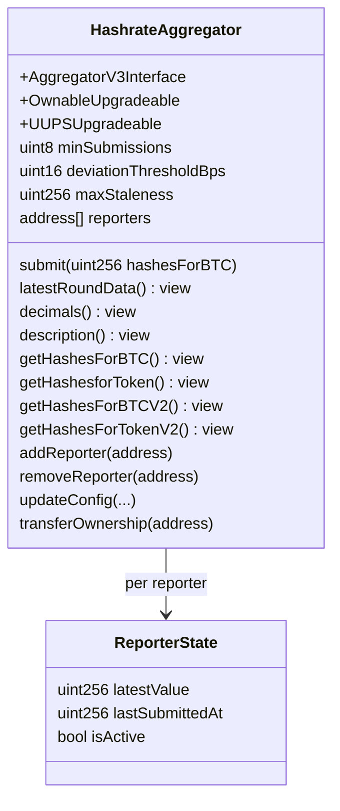
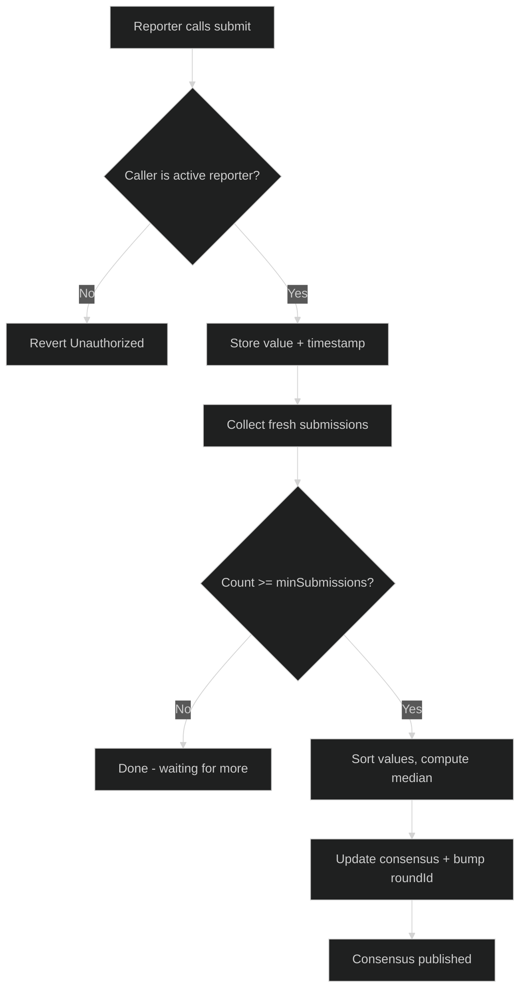

# Contract & Consumer Reference

> **Status**: Reference document — technical detail extracted from the architecture options doc
> **Parent**: [Oracle Decentralization Options](01-architecture-options.md)

---

## HashrateAggregator Contract Design

### Interface Requirements

The new aggregator must implement all functions currently consumed by downstream contracts and the subgraph indexer.

| Function | Used By | Source Interface |
|----------|---------|-----------------|
| `latestRoundData()` | Perps DEX (`HashPowerPerpsDEX.getMarketPrice()`) | `AggregatorV3Interface` |
| `decimals()` | Perps DEX (reads `oracleDecimals` on `setOracle()`) | `AggregatorV3Interface` |
| `description()` | Informational | `AggregatorV3Interface` |
| `getHashesForBTC()` | Subgraph block handler | Current `HashrateOracle` |
| `getHashesforToken()` | Futures (`Futures._getHashesForToken()`), Subgraph | Current `HashrateOracle` |
| `getHashesForBTCV2()` | Potential consumers | Current `HashrateOracle` |
| `getHashesForTokenV2()` | Potential consumers | Current `HashrateOracle` |

**Important**: Futures and Perps use **different interfaces**:
- **Futures** (`Futures.sol`): Types the oracle as `HashrateOracle`, calls `getHashesforToken()`
- **Perps** (`HashPowerPerpsDEX.sol`): Types as `AggregatorV3Interface`, calls `latestRoundData()`

The new contract must satisfy both.

### Class Diagram



### Submit Flow



---

## Consumer Details

### Futures Marketplace (`Futures.sol`)

- **Oracle type**: `HashrateOracle` (custom, not `AggregatorV3Interface`)
- **Function called**: `getHashesforToken()` via private `_getHashesForToken()`
- **Oracle address**: Storage variable, set in `initialize()`, changeable via `setOracle(address)` (owner only)
- **Migration**: `setOracle(newAggregatorAddress)` — single owner transaction
- **Dependency**: `hashprice-oracle` git package in `contracts/package.json`

### Perps DEX (`HashPowerPerpsDEX.sol`)

- **Oracle type**: `AggregatorV3Interface`
- **Function called**: `latestRoundData()` inside `getMarketPrice()`
- **Staleness check**: Reverts with `OracleStale()` if `block.timestamp - updatedAt > MAX_ORACLE_STALENESS` (1 hour)
- **Oracle address**: Storage variable, set in `initialize()`, changeable via `setOracle(AggregatorV3Interface)` (owner only)
- **Migration**: `setOracle(newAggregatorAddress)` — single owner transaction
- **Also reads**: `decimals()` to set `oracleDecimals` on `setOracle()`

### Goldsky Subgraph (Indexer)

- **Oracle address**: Configured via `HASHRATE_ORACLE_ADDRESS` env var in `subgraph.template.yaml`
- **Functions called (block handler)**: `try_getHashesForBTC()`, `try_getHashesforToken()`
- **Events indexed**: `Initialized(uint64)` only
- **ABI source**: `../contracts/abi/HashrateOracle.json`
- **Migration**: Update `HASHRATE_ORACLE_ADDRESS` and `START_BLOCK_HASHRATE_ORACLE` env vars, rebuild, redeploy
- **Handler changes**: None if function signatures match; may need update if `getHashesForBTC()` return type changes (current returns `Feed` struct)
- **Extension opportunity**: Index `submit()` events for transparency dashboard

### Off-Chain Services

| Service | Oracle Reference | Migration |
|---------|-----------------|-----------|
| Margin-call Lambda | `HASHRATE_ORACLE_ADDRESS` env var via Terraform | Update `hashrate_oracle_address` in tfvars |
| Market Maker (Futures) | Reads via subgraph (`hashrateIndexes` query) | Subgraph migration handles it |
| Market Maker (Perps) | Calls `getMarketPrice()` on perps contract | No change needed (indirect) |
| Keeper (Perps) | Calls `getMarketPrice()` on perps contract | No change needed (indirect) |

---

## Adjustable Parameters

| Parameter | Type | Initial | Description |
|-----------|------|---------|-------------|
| `minSubmissions` | `uint8` | 1 → 2 → N | Minimum fresh submissions for consensus |
| `deviationThresholdBps` | `uint16` | 2000 (20%) | Circuit breaker for outlier rejection |
| `maxStaleness` | `uint256` | 900 (15 min) | Freshness window for submissions |
| `reporters` | `address[]` | Whitelist | Authorized reporter addresses |
| `owner` | `address` | Deployer | Manages reporters, config, upgrades; transferable |

**Why median**: Resistant to outliers. `[105, 104, 999999]` → median is `105`.

**Circuit breaker**: Submissions deviating > `deviationThresholdBps` from current consensus are rejected. Set wide initially (20%) as a safety net.

---

## Design Decisions

### `getHashesForBTC()` Return Type

The current contract has two versions:

- `getHashesForBTC()` → returns `Feed` struct `{ value, updatedAt, ttl }` — marked `@dev deprecated`
- `getHashesForBTCV2()` → returns `(uint256 value, uint256 updatedAt)` — cleaner tuple

**Recommendation**: The aggregator should implement both for backward compatibility, but use the V2 tuple pattern as the canonical form. The `Feed` struct's `ttl` field is a deprecated storage artifact (`hashesForBTCTTL`) that has no meaningful role in the aggregator — return `maxStaleness` in its place so the struct is still populated. The subgraph currently calls `try_getHashesForBTC()` which expects the `Feed` struct, so it must be present.

```solidity
function getHashesForBTC() external view returns (Feed memory) {
    return Feed({ value: consensus.value, updatedAt: consensus.updatedAt, ttl: maxStaleness });
}

function getHashesForBTCV2() external view returns (uint256 value, uint256 updatedAt) {
    return (consensus.value, consensus.updatedAt);
}
```

### `getRoundData()` — Historical Rounds

The current contract reverts with `NotImplemented()`. **Recommendation**: keep this behavior initially. The subgraph indexes via block handlers and `getHashesForBTC()`, not `getRoundData()`. If historical round queries become needed, they can be added in a future upgrade — the UUPS pattern supports this.

### BTC/USD Price Feed Reference

The current contract sets `btcTokenOracle` as `immutable` in the constructor. Since UUPS proxies run the constructor only on the implementation contract (not the proxy), this works but means changing the Chainlink feed address requires a full implementation upgrade.

**Recommendation**: Make the BTC/USD feed address owner-configurable with an event:

```solidity
AggregatorV3Interface public btcTokenOracle;

function setBtcOracle(address newOracle) external onlyOwner {
    btcTokenOracle = AggregatorV3Interface(newOracle);
    emit BtcOracleUpdated(newOracle);
}
```

This allows swapping the Chainlink BTC/USD feed (e.g., if Chainlink deploys a new address on Base) without a contract upgrade. Continue using Chainlink as the BTC/USD source — it's battle-tested and already integrated.
