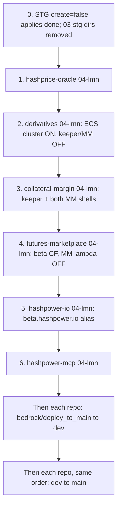

# DEV → MAIN Promotion Runbook

> Single source of truth for promoting **testnet (`dev`)** to **mainnet (`main`)** across the repos that make these surfaces work together:
>
> | Surface | DEV (testnet / Base Sepolia) | MAIN now (advertise) | MAIN later (apex cutover) |
> | --- | --- | --- | --- |
> | Trading UI (futures + perps) | https://dev.hashpower.exchange | https://beta.hashpower.exchange | https://hashpower.exchange |
> | Agent docs / `llms.txt` / `/build` | https://dev.hashpower.io | https://beta.hashpower.io | https://hashpower.io |
> | Hosted MCP (knowledge + simulate) | https://mcp.dev.hashpower.io/mcp | https://mcp.hashpower.io/mcp | unchanged |
>
> **Beta is frontend naming only.** Workload still runs in **titanio-lmn (`04-lmn`)** against **Base mainnet** contracts and the **LMN Goldsky** project. Do not stand up a new AWS account or a new chain. When we drop the `beta.` prefix later, that is DNS / CloudFront aliases + baked origin strings — not a second promotion.
>
> **STG is decommissioned.** `03-stg` applies are done and those directories are removed from `bedrock/deploy_to_main`. Do not recreate them. Spot-indexer state in S3 stays; do not destroy it.
>
> **There is no STG promotion.** Do not PR into `stg`, do not apply `.bedrock/03-stg/` as a cutover step, and do not wait on `stg.hashpower.exchange`.
>
> Status legend: `[ ]` todo · `[x]` done · `(YOU)` operator · `(ORG)` org admin · `(EXT)` waiting on contract addresses.
>
> Updated: 2026-09-21. This is the only promotion runbook.

## 0. Operating model

Feature work lands on **`dev`** (titanio-dev, Base Sepolia / testnet). When pre-reqs are done, we **PR `dev` → `main`** (titanio-lmn, Base mainnet). Push to `main` is what triggers production CI.

Do the infra applies **before any `dev` → `main` merge**. A push to `main` is what starts LMN CI, and that CI fails if the shell or `AWS_ROLE_ARN_LMN` is missing.

Per repo:

1. `terragrunt plan` then `apply` `.bedrock/04-lmn/` (shell, IAM/OIDC, DNS, Secrets Manager).
2. Copy `terragrunt output github_actions_role_arn` to repo secret **`AWS_ROLE_ARN_LMN`** when that apply creates a role. Derivatives does not (`create_core = false`).
3. After **every** repo's apply has succeeded, merge `bedrock/deploy_to_main` → `dev` in the same order. That redeploys **dev** from `config/dev.env`. It does not create LMN.
4. Then PR `dev` → `main` in the same order, one repo at a time. CI deploys LMN from `config/prd.env` plus the secrets that repo still keeps in GitHub.
5. Verify that repo before merging the next one to `main`.

Public addresses and subgraph URLs live in `config/dev.env` and `config/prd.env`. GitHub Environments keep secrets and OIDC only. Do not put those public values back into GitHub variables.

### Accounts / regions (all `us-east-1`)

| Lifecycle | AWS account | Account # | Git branch | Chain |
| --- | --- | --- | --- | --- |
| DEV | titanio-dev | `434960487817` | `dev` | Base Sepolia `84532` |
| LMN | titanio-lmn | `330280307271` | `main` | Base `8453` |
| STG (decommission) | titanio-stg | `464450398935` | `stg` | Base `8453` (legacy; tear down) |

TF state: `s3://titanio-terraform-states/state/titanio/afs/<repo>/lmn.tfstate` (profile `titanio-mst`).
`infra-update.yml` Slack-notifies on `.bedrock/**`; **`terragrunt apply` is manual**.

New GitHub repos default to **immutable OIDC subjects** (`org@id/repo@id`). IAM trust policies must allow that form or `sts:AssumeRoleWithWebIdentity` fails. hashpower-mcp already trusts both; copy that pattern if a new repo's GitHub Actions role is denied.

### Repos in this promotion

| Repo | What it ships on DEV / MAIN |
| --- | --- |
| `hashprice-oracle` | Oracle updater Lambda, oracles subgraph, `@hashpower/oracle-abi` |
| `collateral-margin` | CollateralVault subgraph, unified keeper, perps + futures MMs, `@hashpower/collateral-abi` |
| `derivatives-marketplace` | Perps subgraph, `@hashpower/perps-abi` (legacy keeper/MM **off** in `04-lmn`) |
| `futures-marketplace` | Trading UI (`dev` / `beta.hashpower.exchange`), futures subgraph, notifications, `@hashpower/futures-abi` |
| `hashpower-io` | Commercial site (`dev` / `beta.hashpower.io`) — `llms.txt`, `/build`, `/deployments.json`, `/semantics` |
| `hashpower-mcp` | Hosted Streamable HTTP MCP + npm `@hashpower/mcp` |

**Keep running (do not decommission):** `spot-marketplace` (STG + LMN) and the **spot-indexer** ECS services in `hashprice-oracle` (`svc-spot-indexer-stg` and `svc-spot-indexer-lmn`). Spot still depends on that indexer.

Out of scope otherwise: `governance-token`, `proxy-router`.

### Dependency chain



ABI publish and MCP bump are **pre-wired**: a publish from `dev` dispatches `source_ref=dev` (testnet site + MCP bump on `dev`); a publish from `main` dispatches `source_ref=main`. No workflow rewrite at cutover.

---

## Part 0 — Decommission STG (done 2026-09-21)

STG was not a promotion target. The titanio-stg account conflicted with this cutover in two ways:

1. **DNS.** `beta.hashpower.exchange` is a Route53 A-alias in the **hashpower.exchange root zone** (titanio-net) pointing at STG CloudFront `EKX6RQK5B0L8G` (`d3k7d4fq176p9s.cloudfront.net`). That name is what we want to advertise for LMN. Two CloudFront distributions cannot share it.
2. **On-chain writers.** STG `.bedrock/03-stg` already targets **Base mainnet (`8453`)**. Live schedules/services will race LMN oracles and market makers if we bring mainnet writers up in titanio-lmn while STG is still ticking.

`beta.hashpower.io` is **not** taken (no record in the hashpower.io root zone). hashpower-io has no `03-stg` stack. Hosted MCP has no STG stack; `mcp.hashpower.io` does not exist yet.

**Spot stays.** Do not `terragrunt destroy` `spot-marketplace` `03-stg` / `04-lmn`, and do not destroy `hashprice-oracle` `03-stg` (that state also owns `svc-spot-indexer-stg`). Turn the STG **oracle updater** off with `oracle_lambda.create = false` and apply.

### Live inventory (2026-09-21)

**Already in titanio-lmn (do not recreate from scratch):**

- CloudFront `E22T4IOXQ3AEBG` aliases **`hashpower.exchange`** (apex already live).
- CloudFront `E23FNK6WGKAY89` aliases **`hashpower.io`** + **`www.hashpower.io`**.
- ECS: `ecs-futures-marketplace-lmn` (notifications), `ecs-hashprice-oracle-lmn` (spot indexer).
- Lambdas + EventBridge **enabled**: `oracle-update-schedule-v2-lmn` (5 min), `market-maker-schedule-lmn` (1 min).
- No LMN ECS cluster yet for collateral-margin, derivatives, or hashpower-mcp.

**Still in titanio-stg (tear down):**

| Stack | Live resources | Conflict |
| --- | --- | --- |
| `futures-marketplace` `03-stg` | CF `EKX6RQK5B0L8G` = **`beta.hashpower.exchange`**; CF `E38DIZITURZEQ8` = `stg.hashpower.exchange`; ECS notifications 1/1; RDS `notifications-v2-stg` | **Hard:** beta hostname |
| `hashprice-oracle` `03-stg` | Lambda `futures-oracle-update-v2` on `oracle-update-schedule-v2-stg` (enabled, 5 min). **Keep** `svc-spot-indexer-stg` 1/1 | Disable oracle writer only — **do not destroy** this stack |
| `derivatives-marketplace` `03-stg` | `svc-perps-mktmkr-stg` 1/1; `svc-perps-keeper-stg` desired 1 / running 0; `perpsmm.stg` + `keeper.stg` ALBs | **Hard:** mainnet MM |
| `futures-marketplace` MM lambda | `market-maker-stg` on `market-maker-schedule-stg` (enabled, 5 min) | **Hard:** mainnet MM |
| `collateral-margin` `03-stg` | **No ECS cluster** — likely never applied or already gone | Confirm empty state |
| `proxy-router` `03-stg` | router + validator ECS (out of scope) | Optional leftover |
| `spot-marketplace` `03-stg` / `04-lmn` | CloudFront `marketplace.stg.lumerin.io` and `marketplace.lumerin.io`; LMN `svc-spot-indexer-lmn` | **Keep** — still serving spot |

Goldsky: **reuse STG-Exchange as LMN-Exchange** (same project ID `project_cmmz5dm4l7ocp01xng61y5nwr`, already indexing Base mainnet). Rename in the dashboard; do not create a second project. See Part B.

### 0a. Encode the teardown in `03-stg` tfvars `(YOU)`

No AWS CLI mutations. `create = false` + `terragrunt apply` is what stops writers and releases DNS. Work is on **`bedrock/deploy_to_main`**.

| Repo | File | Flags | Effect on apply |
| --- | --- | --- | --- |
| `hashprice-oracle` | `.bedrock/03-stg/terraform.tfvars` | `oracle_lambda.create = false`; subgraph/staleness monitors off; **`spot_indexer.create = true`** | Destroys oracle Lambda + EventBridge `oracle-update-schedule-v2-stg`. Keeps `svc-spot-indexer-stg`. |
| `derivatives-marketplace` | same | `marketmaker_service.create = false`; `perpskeeper_service.create` already false | Destroys perps MM (+ leftover keeper drift). |
| `futures-marketplace` | same | `beta_alias.create = false`; `market_maker.create = false`; `notifications_service.create = false`; **`create_core` stays true** | Destroys beta CF `EKX6RQK5B0L8G` + root-zone A-record; MM Lambda + schedule; notifications ECS/RDS. Leaves `stg.hashpower.exchange` UI + IAM. |
| `collateral-margin` | same | MM create flags false | **Do not apply greenfield.** No ECS cluster in titanio-stg. |
| `spot-marketplace` | — | unchanged | Keep. |

Do **not** `terragrunt destroy` `hashprice-oracle` `03-stg` (spot-indexer lives there). Do **not** `terragrunt destroy` futures/derivatives either: `create=false` apply is enough, and a full destroy would take GitHub OIDC roles and hit `retain_on_delete` on the STG UI CloudFront.

- [x] `(YOU)` tfvars flipped on `bedrock/deploy_to_main` (2026-09-21).

### 0b. `terragrunt apply` those stacks `(YOU)`

`secret.auto.tfvars` must still be present. Plan first; apply only that plan. Writers first, then the beta hostname.

```bash
# 1) hashprice-oracle — oracle off, spot-indexer stays
cd /Volumes/moon/repo/hub/hashprice-oracle/.bedrock/03-stg
AWS_PROFILE=titanio-stg terragrunt plan
AWS_PROFILE=titanio-stg terragrunt apply

# 2) derivatives — perps MM / leftover keeper
cd /Volumes/moon/repo/hub/derivatives-marketplace/.bedrock/03-stg
AWS_PROFILE=titanio-stg terragrunt plan
AWS_PROFILE=titanio-stg terragrunt apply

# 3) futures — MM + notifications + beta.hashpower.exchange
cd /Volumes/moon/repo/hub/futures-marketplace/.bedrock/03-stg
AWS_PROFILE=titanio-stg terragrunt plan
AWS_PROFILE=titanio-stg terragrunt apply
```

Expect destroys (not creates) of: oracle Lambda/schedule, perps MM ECS, futures MM Lambda/schedule, beta CloudFront + Route53, notifications RDS. Expect **zero** changes to `aws_ecs_service` for spot-indexer.

**Gotchas:**

- Futures **marketplace** CloudFront `E38DIZITURZEQ8` (`stg.hashpower.exchange`) is `retain_on_delete = true` and is **not** in this apply (`create_core` still true).
- Beta alias CloudFront `retain_on_delete = false`, so the apply deletes `EKX6RQK5B0L8G`.
- After apply, do not push `stg` — workflows on `stg` would recreate MM/oracle from GitHub env, fighting these flags until `bedrock/deploy_to_main` is on `dev`/`stg` or those workflows are locked.
- `spot-marketplace` and `proxy-router` `03-stg` stay.

### 0c. Prove apply did the job `(YOU)`

Read-only checks (or a follow-up `terragrunt plan` that is empty for these resources):

```bash
cd /Volumes/moon/repo/hub/hashprice-oracle/.bedrock/03-stg
AWS_PROFILE=titanio-stg terragrunt plan   # no oracle lambda create; spot-indexer unchanged

cd /Volumes/moon/repo/hub/futures-marketplace/.bedrock/03-stg
AWS_PROFILE=titanio-stg terragrunt plan   # no beta_alias / market_maker / notifications
```

- [x] `(YOU)` `terragrunt plan` clean on the three STG applies above (2026-09-21).
- [x] `(YOU)` `svc-spot-indexer-stg` and `svc-spot-indexer-lmn` still 1/1; `beta.hashpower.exchange` DNS empty; STG oracle/MM schedules and CF `EKX6RQK5B0L8G` gone.
- [x] `.bedrock/03-stg/` removed from `bedrock/deploy_to_main` in the promotion repos after those applies. State remains in S3. Do not destroy the hashprice-oracle STG state; it still owns `svc-spot-indexer-stg`.

### Beta aliases on LMN (after 0c, during Part D)

| Hostname | How | When |
| --- | --- | --- |
| `beta.hashpower.exchange` | `beta_alias.create = true` and `apex_site = "hold"` in `futures-marketplace/.bedrock/04-lmn/terraform.tfvars`. Beta CloudFront serves the app bucket. Apex stays on `E22T4IOXQ3AEBG` and serves the static coming-soon bucket, which CI does not write. | Part D futures apply |
| `beta.hashpower.io` | Add `beta.hashpower.io` to the **existing** LMN CloudFront aliases (`E23FNK6WGKAY89`). Root ACM is `hashpower.io` + `*.hashpower.io`, so no second cert. Add a Route53 A-alias in titanio-net. Also add the origin to the subscribe Lambda CORS list. | Part D.6 apply |
| `mcp.hashpower.io` | Unchanged. Not a frontend name. `04-lmn` still creates `mcp.hashpower.io`. | Part D.7 apply |

Baked `llms.txt` / MCP docs may keep saying `https://hashpower.io` and `https://hashpower.exchange` during beta — those apex names already resolve in titanio-lmn. Marketing/share URLs use `beta.*` until the later cutover.

Later cutover for the exchange apex: set `apex_site = "beta"` in that same tfvars and apply. Terraform removes `hashpower.exchange` from the apex distribution, adds it to the beta distribution, and moves the apex DNS record. UI deploys keep going to that distribution. Do this only when the static page should come down.

---

## Part A — Already true on DEV (2026-09-15)

Do not treat “prod is not up yet” as a DEV gap.

- [x] `@hashpower/oracle-abi`, `collateral-abi`, `futures-abi`, `perps-abi` publishing from `dev`.
- [x] `@hashpower/mcp` on npm (Trusted Publisher, environment `npm-publish`).
- [x] Hosted MCP at https://mcp.dev.hashpower.io/mcp — Fargate 1/1, stateless Streamable HTTP, ALB stickiness off, `HASHPOWER_ENV=testnet`, live `get_hashprice` / `get_deployments`.
- [x] Deploy workflow maps `dev` → titanio-dev and `main` → titanio-lmn (`mcp.hashpower.io`).
- [x] hashpower-io deploy bakes `PUBLIC_MCP_URL` (`mcp.dev.hashpower.io/mcp` vs `mcp.hashpower.io/mcp`).
- [x] GitHub environments `dev` / `main` / `npm-publish` exist on hashpower-mcp.
- [x] hashpower-mcp OIDC role `github-actions-hashpower-mcp-v1-dev` trusts immutable subjects (`Lumerin-protocol@92322520/hashpower-mcp@1370174274`).
- [x] `.bedrock/04-lmn/` modules exist for every repo in this runbook (apply at cutover, not a rewrite).

---

## Part B — MAIN pre-wiring (do on `dev` now so cutover is apply + PR)

Code/CI (landed or landing with the PRs next to this doc):

- [x] ABI publish workflows trigger on **`dev` and `main`**.
- [x] `@hashpower/mcp` publish workflow triggers on **`dev` and `main`**.
- [x] ABI publish dispatches `abi-published` to hashpower-io **and** hashpower-mcp, with `source_ref` = the branch that published.
- [x] hashpower-mcp `bump-abi.yml` opens a PR on that same branch (`dev` or `main`).
- [x] GitHub `npm-publish` environment on the four ABI repos allows branch **`main`** (was `dev`-only).

Operator, before the first `main` push (not a code change):

- [ ] **(YOU)** Expand `HASHPOWER_IO_DISPATCH_TOKEN` (or add `HASHPOWER_MCP_DISPATCH_TOKEN`) so the PAT can `repository_dispatch` + open PRs on **hashpower-mcp**. Same token already talks to hashpower-io. Without this, ABI publishes still succeed; MCP just will not auto-bump (`continue-on-error`).
- [ ] **(YOU)** After `hashpower-mcp` `.bedrock/04-lmn` apply: set repo secret `AWS_ROLE_ARN_LMN` to `github-actions-hashpower-mcp-v1-lmn`.
- [ ] **(YOU)** GitHub environment `main` on hashpower-mcp: optional `HASHPOWER_RPC_URL` (else public Base RPC); vars `HASHPOWER_ENV=mainnet`, `HASHPOWER_DOCS_URL=https://hashpower.io` (workflow has the same defaults).
- [x] **(ORG)** Rename Goldsky project **STG-Exchange → LMN-Exchange**. Project ID stays `project_cmmz5dm4l7ocp01xng61y5nwr` (DEV-Exchange `project_cmmz59uoa7b5201wthnkxbuqy` is untouched). Copy the existing project API key into org secret `LMN_GOLDSKY_API_KEY` (or mint a new key on the renamed project). Add `lmn-latest` tags on the current live versions (`hpow-oracles/v3.1.86-stg`, `hpow-futures/v3.2.373-stg`, `hpow-derivatives/v3.0.273-stg`) so URLs resolve before the first `main` CI. Set org vars:

  | Var | Value |
  | --- | --- |
  | `LMN_GS_ORACLES` | `https://api.goldsky.com/api/public/project_cmmz5dm4l7ocp01xng61y5nwr/subgraphs/hpow-oracles/lmn-latest/gn` |
  | `LMN_GS_FUTURES` | `https://api.goldsky.com/api/public/project_cmmz5dm4l7ocp01xng61y5nwr/subgraphs/hpow-futures/lmn-latest/gn` |
  | `LMN_GS_DERIVATIVES` | `https://api.goldsky.com/api/public/project_cmmz5dm4l7ocp01xng61y5nwr/subgraphs/hpow-derivatives/lmn-latest/gn` |
  | `LMN_GS_VAULT` | `https://api.goldsky.com/api/public/project_cmmz5dm4l7ocp01xng61y5nwr/subgraphs/collateral-vault/lmn-latest/gn` (404 until first vault deploy) |
  | `LMN_GS_POINTS` | `https://api.goldsky.com/api/public/project_cmmz5dm4l7ocp01xng61y5nwr/subgraphs/hpow-points/lmn-latest/gn` (404 until first points deploy) |

  `04-lmn` `gs_subgraphs` on `bedrock/deploy_to_main` already use the three live URLs. A `main` subgraph workflow deploys a new semver (`vX.Y.Z`, no `-stg` suffix) and moves tag `lmn-latest`.
- [ ] **(YOU)** Confirm each repo’s GitHub `main` environment has addresses, start blocks, RPC, and WalletConnect — see Part C. Missing `main` env secrets was a real LMN miss on derivatives.

---

## Part C — Config and secrets (current)

`config/prd.env` is the public mainnet config (addresses, chain, start blocks, subgraph URLs). `config/dev.env` is testnet. CI loads the file for the GitHub environment (`dev` → `dev.env`, `main` → `prd.env`). Do not copy those keys back into GitHub variables.

`.bedrock/04-lmn/terraform.tfvars` is already aligned to those addresses where the module has a matching field. Chain id is Base `8453`.

Secrets that stay in GitHub:

- **hashprice-oracle `main`:** `PRIVATE_KEY`, `ETHEREUM_RPC_URL`, `BITCOIN_RPC_URL`. The keeper Lambda reads them from the function environment. Secrets Manager copies are unused at runtime.
- **futures-marketplace `main`:** `REACT_APP_READ_ONLY_ETH_NODE_URL`, `REACT_APP_WALLET_CONNECT_ID`. They are baked into the UI bundle. `REACT_APP_SUBGRAPH_PERPS_URL` is public and can be deleted.
- **derivatives-marketplace:** subgraph deploy uses the org Goldsky key only. The disabled contract workflow is the only thing that wanted `ETH_NODE_ADDRESS` / `ETHERSCAN_API_KEY`. Dev copies of those were deleted.
- **collateral-margin:** Alchemy key and the three private keys are Secrets Manager, seeded from gitignored `secret.auto.tfvars`. Dev apply is done. LMN `secret.auto.tfvars` still needs `perps_mm_private_key` before the `04-lmn` plan. Do not put those keys back on the GitHub environment.

---

## Part D — Execution order

Finish every `04-lmn` apply before merging anything to `main`. Then merge `bedrock/deploy_to_main` → `dev` in this same order, then PR `dev` → `main` in this same order. A `dev` merge redeploys testnet only.

Flags already set on `bedrock/deploy_to_main`: oracle Lambda on and chain `8453`; derivatives keeper/MM off and **ECS cluster on** (collateral looks that cluster up); collateral keeper and both MM shells on; futures `beta_alias` on, `apex_site = "hold"`, MM lambda off; hashpower-io `beta.hashpower.io` alias in the LMN site list.

### Applies

1. **hashprice-oracle** `.bedrock/04-lmn/`. Spot indexer stays. Copy `github_actions_role_arn` to `AWS_ROLE_ARN_LMN` if the output changed. `main` already has `PRIVATE_KEY`, `ETHEREUM_RPC_URL`, `BITCOIN_RPC_URL`.
2. **derivatives-marketplace** `.bedrock/04-lmn/`. This creates `ecs-derivatives-marketplace-lmn` and does not create a GitHub role (`create_core = false`). Keeper and MM stay off. Collateral's plan fails without this cluster (that was the `04-lmn` error).
3. **collateral-margin** `.bedrock/04-lmn/`. Add `perps_mm_private_key` to `secret.auto.tfvars` first. Copy the role ARN to `AWS_ROLE_ARN_LMN`. Keys stay in Secrets Manager, not GitHub.
4. **futures-marketplace** `.bedrock/04-lmn/`. `apex_site = "hold"`: `https://hashpower.exchange` stays the static page; `https://beta.hashpower.exchange` is the app. Notifications and UI shell. MM lambda stays off. Copy the role ARN. Keep `REACT_APP_READ_ONLY_ETH_NODE_URL` and `REACT_APP_WALLET_CONNECT_ID` on `main`. Apply this before the main UI workflow runs, so that workflow publishes to the beta distribution.
5. **hashpower-io** `.bedrock/04-lmn/`. Adds `beta.hashpower.io` on the existing distribution.
6. **hashpower-mcp** `.bedrock/04-lmn/`. Creates `mcp.hashpower.io`. Set `AWS_ROLE_ARN_LMN` from the output.

### Pull requests, after those applies

Same order. Merge `bedrock/deploy_to_main` into `dev` for a repo, confirm dev still works, then PR that repo's `dev` into `main` before starting the next `main` merge.

1. hashprice-oracle — Lambda env from `config/prd.env` plus the three GitHub secrets; Goldsky `hpow-oracles` moves to `lmn-latest`.
2. derivatives-marketplace — Goldsky perps subgraph only. No AWS role.
3. collateral-margin — keeper and portfolio market maker. Fund the MM wallet with USDC before the service starts. Keeper `DRY_RUN=true` first.
4. futures-marketplace — UI at `beta.hashpower.exchange`, notifications, futures subgraph.
5. hashpower-io — `beta.hashpower.io` docs.
6. hashpower-mcp — hosted MCP.

- [x] Legacy HashrateOracle `0x614dCAfa…` `updaterAddress` is already the STG lambda wallet `0x67C1A773…`. HashpriceBTC has no updater role.

---

## Part E — Done criteria (beta period)

- [x] STG writers and `beta.hashpower.exchange` removed. `.bedrock/03-stg/` is gone from this branch. Spot-indexer state stays in S3.
- [ ] Spot marketplace still up; `svc-spot-indexer-stg` and `svc-spot-indexer-lmn` healthy.
- [ ] https://beta.hashpower.exchange Futures + Perps render live mainnet data; Goldsky LMN subgraphs healthy.
- [ ] Unified keeper + both MMs healthy; oracle Lambda fresh; no Route53 collisions.
- [ ] https://beta.hashpower.io/llms.txt, `/build`, and `/build/mcp.md` point at `https://mcp.hashpower.io/mcp`, client key `hashpower`, and current `@hashpower/*-abi` versions.
- [ ] `GET https://mcp.hashpower.io/health` reports `"name":"hashpower"` and `"env":"mainnet"`; initialize instructions point at hashpower.io (or beta.hashpower.io) `/build/mcp.md`.
- [ ] https://mcp.hashpower.io/mcp is knowledge + simulate only (no keys, no session stickiness).
- [ ] CloudWatch / subgraph `_meta` green.

---

## Part F — What not to do

- Do not PR `dev` → `stg` or recreate `.bedrock/03-stg/`.
- Do not destroy the hashprice-oracle STG Terraform state or scale `svc-spot-indexer-*` to 0 while spot is a product.
- Do not create a second Goldsky project for LMN. Project ID stays `project_cmmz5dm4l7ocp01xng61y5nwr`. Do not point `LMN_GS_*` at DEV-Exchange. If Goldsky says a version already exists, the CI deletes that version and retries.
- Do not flip ABI/MCP publish workflows off `dev` until testnet npm bumps are finished. Both branches are allowed on purpose.
- Do not start LMN CI before that repo's `04-lmn` apply. Set `AWS_ROLE_ARN_LMN` from `terragrunt output` after the apply. Derivatives has no role (`create_core = false`).
- Do not put public addresses back into GitHub variables. They live in `config/prd.env`.
- Do not grant a new `setHashesForBTC` updater unless a new wallet must call the legacy oracle `0x614dCAfa…`. HashpriceBTC `submitBlock` is permissionless.
- Fund the oracle updater with ETH for gas. Fund the portfolio market maker with the USDC amount you intend to deposit before the service starts; it can pull the whole wallet balance on startup.
- Do not treat MCP as a trading API or add session affinity.
- Do not set futures `apex_site = "beta"` until `https://hashpower.exchange` should serve the app. `"hold"` keeps the static page. The UI workflow must not run against LMN before that apply, or it still targets the apex distribution.
