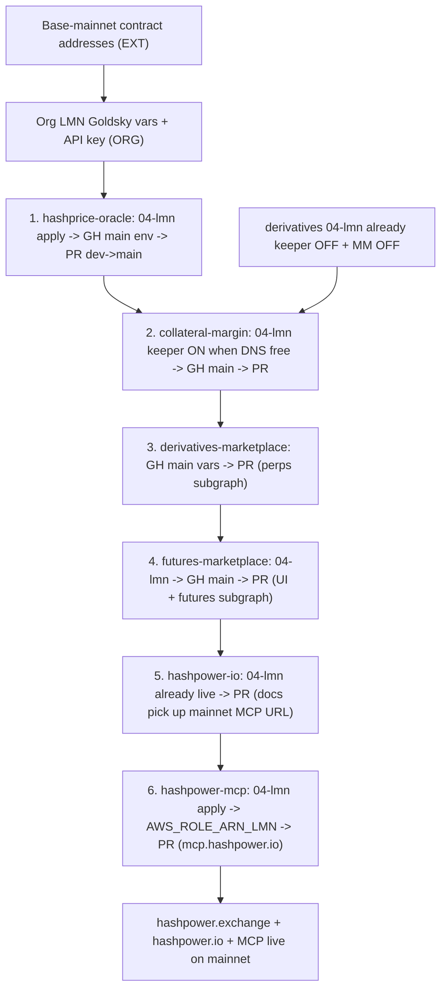

# DEV → MAIN Promotion Runbook

> Single source of truth for promoting **testnet (`dev`)** to **mainnet (`main`)** across the repos that make these surfaces work together:
>
> | Surface | DEV (testnet / Base Sepolia) | MAIN (mainnet / Base) |
> | --- | --- | --- |
> | Trading UI (futures + perps) | https://dev.hashpower.exchange | https://hashpower.exchange |
> | Agent docs / `llms.txt` / `/build` | https://dev.hashpower.io | https://hashpower.io |
> | Hosted MCP (knowledge + simulate) | https://mcp.dev.hashpower.io/mcp | https://mcp.hashpower.io/mcp |
>
> **There is no STG promotion.** Do not PR into `stg`, do not apply `.bedrock/03-stg/` as a cutover step, and do not wait on `stg.hashpower.exchange`. Existing `stg` branches and titanio-stg stacks may linger; they are not on the train.
>
> Status legend: `[ ]` todo · `[x]` done · `(YOU)` operator · `(ORG)` org admin · `(EXT)` waiting on contract addresses.
>
> Updated: 2026-09-15. Lessons from `.ai-docs/lmn-promotion.md` are folded in here.

## 0. Operating model

Feature work lands on **`dev`** (titanio-dev, Base Sepolia / testnet). When pre-reqs are done, we **PR `dev` → `main`** (titanio-lmn, Base mainnet). Push to `main` is what triggers production CI.

Per repo, the wiring path is:

1. `terragrunt apply` `.bedrock/04-lmn/` (infra shell, IAM/OIDC, DNS). **Apply before merging to `main`.**
2. Update the GitHub **`main` environment** vars/secrets (+ org-level Goldsky `LMN_*`).
3. After apply, set repo secret **`AWS_ROLE_ARN_LMN`** from `terragrunt output github_actions_role_arn`.
4. **PR `dev` → `main`**. CI deploys.
5. Verify.

We promote each repo's `dev` as-is (feature branches already merged to `dev` by their owners). Rebase those PRs onto current `origin/dev` before merge.

### Accounts / regions (all `us-east-1`)

| Lifecycle | AWS account | Account # | Git branch | Chain |
| --- | --- | --- | --- | --- |
| DEV | titanio-dev | `434960487817` | `dev` | Base Sepolia `84532` |
| LMN | titanio-lmn | `330280307271` | `main` | Base `8453` |
| STG (not used) | titanio-stg | `464450398935` | `stg` | — |

TF state: `s3://titanio-terraform-states/state/titanio/afs/<repo>/lmn.tfstate` (profile `titanio-mst`).
`infra-update.yml` Slack-notifies on `.bedrock/**`; **`terragrunt apply` is manual**.

New GitHub repos default to **immutable OIDC subjects** (`org@id/repo@id`). IAM trust policies must allow that form or `sts:AssumeRoleWithWebIdentity` fails. hashpower-mcp already trusts both; copy that pattern if a new repo's GitHub Actions role is denied.

### Repos in this promotion

| Repo | What it ships on DEV / MAIN |
| --- | --- |
| `hashprice-oracle` | Oracle updater Lambda, oracles subgraph, `@hashpower/oracle-abi` |
| `collateral-margin` | CollateralVault subgraph, unified keeper, perps + futures MMs, `@hashpower/collateral-abi` |
| `derivatives-marketplace` | Perps subgraph, `@hashpower/perps-abi` (legacy keeper/MM **off** in `04-lmn`) |
| `futures-marketplace` | https://(dev.)hashpower.exchange UI, futures subgraph, notifications, `@hashpower/futures-abi` |
| `hashpower-io` | https://(dev.)hashpower.io — `llms.txt`, `/build`, `/deployments.json`, `/semantics` |
| `hashpower-mcp` | Hosted Streamable HTTP MCP + npm `@hashpower/mcp` |

Out of scope: `spot-marketplace`, `governance-token`, `proxy-router`.

### Dependency chain

ABI publish and MCP bump are **pre-wired**: a publish from `dev` dispatches `source_ref=dev` (testnet site + MCP bump on `dev`); a publish from `main` dispatches `source_ref=main`. No workflow rewrite at cutover.

---

## Part A — Already true on DEV (2026-09-15)

Do not treat “prod is not up yet” as a DEV gap.

- [x] `@hashpower/oracle-abi`, `collateral-abi`, `futures-abi`, `perps-abi` publishing from `dev`.
- [x] `@hashpower/mcp` on npm (Trusted Publisher, environment `npm-publish`).
- [x] Hosted MCP at https://mcp.dev.hashpower.io/mcp — Fargate 1/1, stateless Streamable HTTP, ALB stickiness off, `HASHPOWER_ENV=testnet`, live `get_hashprice` / `get_deployments`.
- [x] Deploy workflow maps `dev` → titanio-dev and `main` → titanio-lmn (`mcp.hashpower.io`).
- [x] hashpower-io deploy bakes `PUBLIC_MCP_URL` (`mcp.dev.hashpower.io/mcp` vs `mcp.hashpower.io/mcp`).
- [x] GitHub environments `dev` / `main` / `npm-publish` exist on hashpower-mcp.
- [x] hashpower-mcp OIDC role `github-actions-hashpower-mcp-v1-dev` trusts immutable subjects (`Lumerin-protocol@92322520/hashpower-mcp@1370174274`).
- [x] `.bedrock/04-lmn/` modules exist for every repo in this runbook (apply at cutover, not a rewrite).

---

## Part B — MAIN pre-wiring (do on `dev` now so cutover is apply + PR)

Code/CI (landed or landing with the PRs next to this doc):

- [x] ABI publish workflows trigger on **`dev` and `main`**.
- [x] `@hashpower/mcp` publish workflow triggers on **`dev` and `main`**.
- [x] ABI publish dispatches `abi-published` to hashpower-io **and** hashpower-mcp, with `source_ref` = the branch that published.
- [x] hashpower-mcp `bump-abi.yml` opens a PR on that same branch (`dev` or `main`).
- [x] GitHub `npm-publish` environment on the four ABI repos allows branch **`main`** (was `dev`-only).

Operator, before the first `main` push (not a code change):

- [ ] **(YOU)** Expand `HASHPOWER_IO_DISPATCH_TOKEN` (or add `HASHPOWER_MCP_DISPATCH_TOKEN`) so the PAT can `repository_dispatch` + open PRs on **hashpower-mcp**. Same token already talks to hashpower-io. Without this, ABI publishes still succeed; MCP just will not auto-bump (`continue-on-error`).
- [ ] **(YOU)** After `hashpower-mcp` `.bedrock/04-lmn` apply: set repo secret `AWS_ROLE_ARN_LMN` to `github-actions-hashpower-mcp-v1-lmn`.
- [ ] **(YOU)** GitHub environment `main` on hashpower-mcp: optional `HASHPOWER_RPC_URL` (else public Base RPC); vars `HASHPOWER_ENV=mainnet`, `HASHPOWER_DOCS_URL=https://hashpower.io` (workflow has the same defaults).
- [ ] **(ORG)** Org Goldsky: `LMN_GOLDSKY_API_KEY` and `LMN_GS_ORACLES` / `LMN_GS_FUTURES` / `LMN_GS_DERIVATIVES` / `LMN_GS_VAULT`. These did not exist at the 2026-06-01 audit.
- [ ] **(YOU)** Confirm each repo’s GitHub `main` environment has addresses, start blocks, RPC, and WalletConnect — see Part C. Missing `main` env secrets was a real LMN miss on derivatives.

---

## Part C — Contract address intake (the gate) `(EXT)`

When Base-mainnet addresses and **start blocks** land, write each value in **three** places:

1. `.bedrock/04-lmn/terraform.tfvars` (where that repo still templates addresses).
2. GitHub environment **`main`** vars.
3. Subgraph manifests (CI reads GitHub vars at build).

Expected set:

- `HASHPRICE_BTC`, `HASHPRICE_USD` / `PRICE_ORACLE`, `BTC_USD_FEED`
- `CollateralVault`, `PortfolioMarginEngine`, `CollateralToken` / USDC
- `Futures` / clone factory, `Perps`

Per-repo `main` vars (names already used on `dev` / historically on `stg`):

- **hashprice-oracle:** `HASHPRICE_BTC_ADDRESS`, `HASHPRICE_USD_ADDRESS`, `BTC_USD_ADDRESS`, `HASHPRICE_START_BLOCK`, `CHAIN_ID=8453`, `NETWORK=base`.
- **collateral-margin:** `VAULT_ADDRESS`, `PME_ADDRESS`, `PERPS_ADDRESS`, `FUTURES_ADDRESS`, `HASHPRICE_USD_ADDRESS`, `BTC_USD_FEED_ADDRESS`, start blocks, keeper/MM counts.
- **derivatives-marketplace:** `PERPS_ADDRESS`, `PRICE_ORACLE_ADDRESS`, `PERPS_START_BLOCK`, `COLLATERAL_TOKEN_ADDRESS`, plus `ETH_NODE_ADDRESS` / `ETHERSCAN_API_KEY` **environment secrets**.
- **futures-marketplace:** `REACT_APP_CHAIN_ID=8453`, `REACT_APP_FUTURES_TOKEN_ADDRESS`, `REACT_APP_PERPS_TOKEN_ADDRESS`, `REACT_APP_CLONE_FACTORY`, `START_BLOCK_FUTURES`, subgraph URL secrets.

Triple-check `chain_id = 8453` in every `04-lmn` tfvars (STG once shipped Arbitrum `42161` by mistake).

---

## Part D — Per-repo sequence

Each repo: **`04-lmn` apply → GH `main` vars/secrets → `AWS_ROLE_ARN_LMN` → PR `dev` → `main` → CI → verify.**

Do not create or fast-forward a `stg` branch.

### 1. hashprice-oracle (price + oracles subgraph)

- [ ] Confirm `main` vars match delivered oracle addresses + `HASHPRICE_START_BLOCK`.
- [ ] (YOU) `terragrunt apply` in `.bedrock/04-lmn/`.
- [ ] PR `dev` → `main`. CI: oracle updater Lambda + Goldsky `hpow-oracles` (LMN tag).
- [ ] (YOU) **Authorize the updater wallet** on HashpriceBTC (`setHashesForBTC` / equivalent). Missed on both prior promotions — Lambda writes BTC/USD, hashrate reverts `Unauthorized()`.
- [ ] Verify: Lambda schedule green, on-chain HashpriceBTC fresh, subgraph `_meta` healthy.

### 2. DNS / keeper / MM ownership (before collateral-margin apply)

Production hostnames that have been contested:

- `keeper.hashpower.exchange`
- `perpsmm.hashpower.exchange`

**Intended end state:** collateral-margin owns unified keeper + both MMs. derivatives `04-lmn` already has `perpskeeper_service.create = false` and `marketmaker_service.create = false`.

collateral-margin `04-lmn` currently: `perps_mm_service.create = true`, `futures_mm_service.create = true`, **`keeper_service.create = false`**. Flip keeper to `true` when the hostname is free, then apply.

- [ ] Confirm no remaining derivatives LMN ALB/service holds `keeper.` / `perpsmm.`.
- [ ] Set collateral-margin `keeper_service.create = true` in `04-lmn` tfvars when ready.

### 3. collateral-margin (vault + PME + keeper + MMs)

- [ ] (YOU) `secret.auto.tfvars` for LMN (RPC, keeper/MM keys) — gitignored.
- [ ] (YOU) `terragrunt apply` `.bedrock/04-lmn/`. Capture `github_actions_role_arn` → `AWS_ROLE_ARN_LMN`.
- [ ] Address-gated `main` vars from Part C. Secrets: `ALCHEMY_API_KEY`, `LIQUIDATOR_PRIVATE_KEY`, `PERPS_MM_PRIVATE_KEY`, `FUTURES_MM_PRIVATE_KEY`, `WEBHOOK_SECRET`.
- [ ] PR `dev` → `main`. CI: keeper, both MMs, `collateral-vault` subgraph.
- [ ] Fund MM wallets with USDC **before** they start. Perps MM deposits the **entire** wallet USDC on startup (`topUpCollateral`) — stop the service if you need to control the amount. Futures MM: ≥500 USDC comfortable. Oracle updater wallet needs ETH for gas.
- [ ] Verify `https://keeper.hashpower.exchange/health`; MMs healthy. Start keeper `DRY_RUN=true` first.

### 4. derivatives-marketplace (perps subgraph only)

- [ ] `main` env vars from Part C.
- [ ] PR `dev` → `main`. CI: Goldsky perps subgraph at the new address / start block.
- [ ] Verify `_meta` advancing, `hasIndexingErrors` false.

### 5. futures-marketplace (public UI + futures subgraph)

- [ ] `main` env: futures/perps/clone addresses, `START_BLOCK_FUTURES`, org `LMN_GS_*`.
- [ ] (YOU) `terragrunt apply` `.bedrock/04-lmn/` (UI S3/CloudFront, apex `hashpower.exchange`, notifications).
- [ ] PR `dev` → `main`. CI: `deploy-futures-ui.yml`, futures subgraph, notifications. Contract upgrades stay on manual dispatch.
- [ ] Verify **https://hashpower.exchange** Futures + Perps against mainnet subgraphs/contracts.

### 6. hashpower-io (agent discovery)

- [ ] `.bedrock/04-lmn` is the production site stack (already used for hashpower.io).
- [ ] PR `dev` → `main`. CI bakes `PUBLIC_MCP_URL=https://mcp.hashpower.io/mcp` into `llms.txt` and `/build`.
- [ ] Verify `https://hashpower.io/llms.txt` lists the hosted MCP URL and `npx @hashpower/mcp` with `HASHPOWER_ENV=mainnet`.

### 7. hashpower-mcp (hosted MCP)

- [ ] (YOU) `terragrunt apply` `.bedrock/04-lmn/` → `mcp.hashpower.io`, role `github-actions-hashpower-mcp-v1-lmn`.
- [ ] Set `AWS_ROLE_ARN_LMN`. Trust policy already includes `environment:main`, `ref:refs/heads/main`, and immutable `org@id/repo@id`.
- [ ] PR `dev` → `main`. CI: GHCR image + Fargate. npm publish runs from `main` (same `npm-publish` environment).
- [ ] Verify `https://mcp.hashpower.io/health` → `env: mainnet`, `network: base`; `tools/list` works with **no** `Mcp-Session-Id`.

---

## Part E — Done criteria

- [ ] https://hashpower.exchange Futures + Perps render live mainnet data; Goldsky LMN subgraphs healthy.
- [ ] Unified keeper + both MMs healthy; oracle Lambda fresh; no Route53 collisions.
- [ ] https://hashpower.io/llms.txt and `/build` point at `https://mcp.hashpower.io/mcp` and current `@hashpower/*-abi` versions.
- [ ] https://mcp.hashpower.io/mcp is knowledge + simulate only (no keys, no session stickiness).
- [ ] CloudWatch / subgraph `_meta` green.

---

## Part F — What not to do

- Do not PR `dev` → `stg` or apply `.bedrock/03-stg/` to “prove” production.
- Do not flip ABI/MCP publish workflows off `dev` until you have actually stopped needing testnet npm bumps. Both branches are allowed on purpose.
- Do not start LMN CI before `04-lmn` apply + `AWS_ROLE_ARN_LMN` — the role ARN does not exist until Terraform creates it (placeholder ARNs have bitten us).
- Do not skip HashpriceBTC updater authorization.
- Do not treat MCP as a trading API or add session affinity.

The older STG checklist is kept as a pointer only: [stg-promotion-runbook.md](./stg-promotion-runbook.md). Bite-sized LMN incident notes: [lmn-promotion.md](./lmn-promotion.md).
