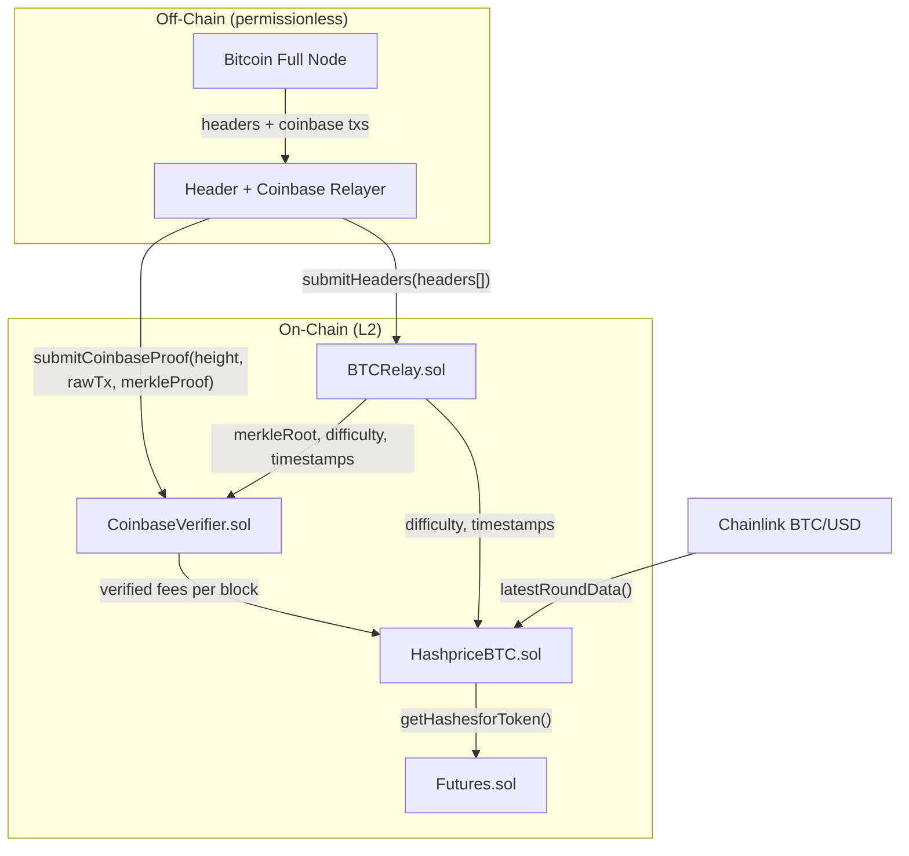
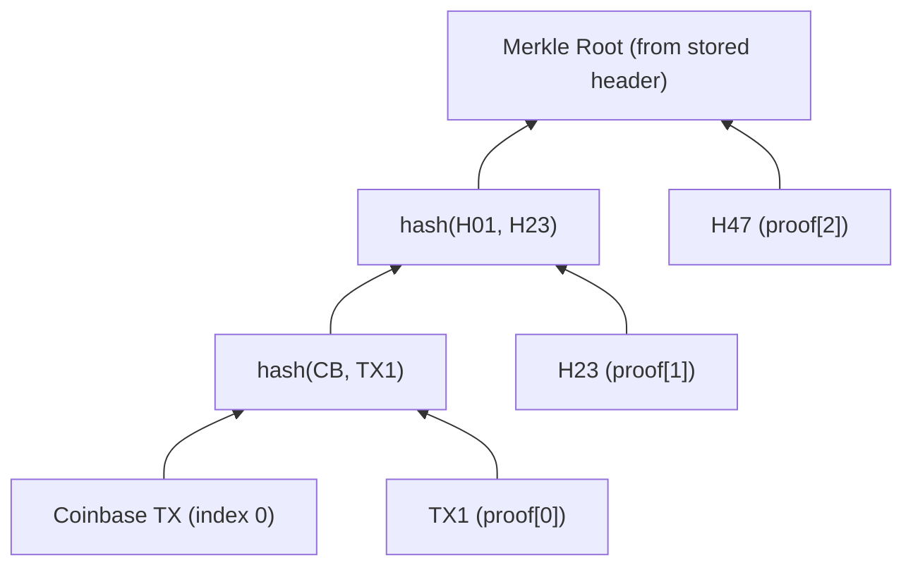

# Fully Trustless Bitcoin Oracle (L2)

## Current State

`HashrateOracle` has two inputs:

- **BTC/USD price**: from Chainlink (`AggregatorV3Interface`) -- already trust-minimized
- `**hashesForBTC`**: set by a single `updaterAddress` -- **fully trusted, no verification

`hashesForBTC` encodes: `difficulty * 2^32 / blockReward`. The goal is to derive this entirely on-chain, including fees, with zero trusted off-chain inputs.

---

## Architecture



Everything is permissionless -- anyone running a Bitcoin full node can submit headers and coinbase proofs. No trusted roles.

---

## Contract 1: BTCUtils.sol (library)

Pure utility functions for Bitcoin data structures. No state.

### Header parsing

Bitcoin block header is exactly 80 bytes, all little-endian:

```
bytes [0..4)    version
bytes [4..36)   prevBlockHash
bytes [36..68)  merkleRoot
bytes [68..72)  timestamp
bytes [72..76)  nBits (compact target)
bytes [76..80)  nonce
```

```solidity
library BTCUtils {
    struct HeaderInfo {
        bytes32 prevBlockHash;
        bytes32 merkleRoot;
        uint32  timestamp;
        uint32  nBits;
    }

    /// @notice Parse an 80-byte Bitcoin header
    function parseHeader(bytes calldata header) internal pure returns (HeaderInfo memory) {
        require(header.length == 80);
        return HeaderInfo({
            prevBlockHash: bytes32(reverseBytes32(header[4:36])),
            merkleRoot:    bytes32(header[36:68]),  // kept LE for merkle verification
            timestamp:     readUint32LE(header, 68),
            nBits:         readUint32LE(header, 72)
        });
    }

    /// @notice Double-SHA256 (Bitcoin's hash function)
    function dsha256(bytes calldata data) internal pure returns (bytes32) {
        return sha256(abi.encodePacked(sha256(data)));
    }

    /// @notice Expand nBits compact target to 256-bit target
    /// nBits format: [exponent (1 byte)][coefficient (3 bytes)]
    /// target = coefficient * 2^(8 * (exponent - 3))
    function nBitsToTarget(uint32 nBits) internal pure returns (uint256) {
        uint256 exponent = uint256(nBits >> 24);
        uint256 coefficient = uint256(nBits & 0x7fffff);
        if (exponent <= 3) {
            return coefficient >> (8 * (3 - exponent));
        }
        return coefficient << (8 * (exponent - 3));
    }

    /// @notice Convert nBits to difficulty
    /// difficulty = genesisTarget / currentTarget
    /// genesisTarget = 0x00000000FFFF << 208 (difficulty 1 target)
    function nBitsToDifficulty(uint32 nBits) internal pure returns (uint256) {
        uint256 target = nBitsToTarget(nBits);
        uint256 diff1Target = 0x00000000FFFF0000000000000000000000000000000000000000000000000000;
        return diff1Target / target;
    }

    /// @notice Compute block subsidy given height (handles halvings)
    /// 50 BTC initially, halves every 210,000 blocks
    function getBlockSubsidy(uint256 height) internal pure returns (uint64) {
        uint256 halvings = height / 210000;
        if (halvings >= 64) return 0;
        return uint64(5000000000 >> halvings); // 50 BTC = 5,000,000,000 satoshis
    }

    /// @notice Read a Bitcoin varint from raw bytes
    /// Returns (value, bytesConsumed)
    function readVarint(bytes calldata data, uint256 offset)
        internal pure returns (uint64 value, uint256 size)
    {
        uint8 first = uint8(data[offset]);
        if (first < 0xfd) {
            return (uint64(first), 1);
        } else if (first == 0xfd) {
            return (uint64(readUint16LE(data, offset + 1)), 3);
        } else if (first == 0xfe) {
            return (uint64(readUint32LE(data, offset + 1)), 5);
        } else {
            return (uint64(readUint64LE(data, offset + 1)), 9);
        }
    }
}
```

### Coinbase transaction output parsing

The critical function -- sum all outputs of a coinbase tx to get `subsidy + fees`:

```solidity
/// @notice Parse a raw Bitcoin coinbase tx and return total output value
/// @dev Coinbase tx uses non-witness serialization for txid computation
/// Layout: version(4) | vinCount(varint,=1) | vin(32+4+varint+script+4) | voutCount(varint) | vouts... | locktime(4)
function parseCoinbaseOutputValue(bytes calldata rawTx) internal pure returns (uint64 totalValue) {
    uint256 offset = 4; // skip version

    // Skip vin (always 1 input for coinbase)
    (uint64 vinCount, uint256 vinSize) = readVarint(rawTx, offset);
    offset += vinSize;
    require(vinCount == 1, "Not a coinbase tx");

    // Skip the single input: prevHash(32) + prevIndex(4) + scriptLen(varint) + script + sequence(4)
    offset += 36; // prevHash + prevIndex
    (uint64 scriptLen, uint256 scriptLenSize) = readVarint(rawTx, offset);
    offset += scriptLenSize + uint256(scriptLen) + 4; // script + sequence

    // Parse outputs
    (uint64 voutCount, uint256 voutSize) = readVarint(rawTx, offset);
    offset += voutSize;

    for (uint64 i = 0; i < voutCount; i++) {
        totalValue += readUint64LE(rawTx, offset); // 8-byte LE value
        offset += 8;
        (uint64 pkScriptLen, uint256 pkSize) = readVarint(rawTx, offset);
        offset += pkSize + uint256(pkScriptLen);
    }
}
```

---

## Contract 2: BTCRelay.sol (header chain)

Stores verified Bitcoin block headers and enforces chain continuity + PoW validity.

### State

```solidity
contract BTCRelay {
    struct StoredHeader {
        bytes32 blockHash;
        bytes32 merkleRoot;
        uint32  timestamp;
        uint32  nBits;
        uint32  height;
        uint256 cumulativeWork;   // total PoW work up to this block
    }

    uint32 public constant CONFIRMATION_DEPTH = 6;

    bytes32 public chainTip;                          // hash of best known block (heaviest chain)
    uint32  public chainHeight;
    mapping(bytes32 => StoredHeader) public headers;  // blockHash => header
    mapping(uint32 => bytes32) public heightToHash;   // height => blockHash (canonical chain only)

    error HeaderAlreadyExists();
    error BrokenChain();
    error InsufficientPoW();
    error InvalidTimestamp();
    error UnexpectedDifficultyChange();
    error InvalidRetarget();
    error UnknownHeight();
}
```

### submitHeaders (with cumulative work + fork resolution)

Headers can extend any known block, not just the current tip. The relay tracks cumulative work and automatically switches to the heaviest chain.

```solidity
/// @notice Submit one or more consecutive Bitcoin block headers
/// @param rawHeaders Concatenated 80-byte headers
/// @param ancestorHash Hash of the block these headers extend (must already be stored)
function submitHeaders(bytes calldata rawHeaders, bytes32 ancestorHash) external {
    require(rawHeaders.length % 80 == 0);
    uint256 count = rawHeaders.length / 80;

    // Ancestor must exist (or be the genesis/checkpoint)
    StoredHeader storage ancestor = headers[ancestorHash];
    require(ancestor.blockHash != bytes32(0), "Unknown ancestor");

    bytes32 prevHash = ancestorHash;
    uint32 height = ancestor.height;
    uint256 cumWork = ancestor.cumulativeWork;

    for (uint256 i = 0; i < count; i++) {
        bytes calldata header = rawHeaders[i * 80 : (i + 1) * 80];

        // 1. Compute block hash
        bytes32 blockHash = BTCUtils.dsha256(header);
        if (headers[blockHash].blockHash != bytes32(0)) revert HeaderAlreadyExists();

        // 2. Parse header fields
        BTCUtils.HeaderInfo memory info = BTCUtils.parseHeader(header);

        // 3. Verify chain linkage
        if (info.prevBlockHash != prevHash) revert BrokenChain();

        // 4. Verify proof-of-work: hash <= target
        uint256 target = BTCUtils.nBitsToTarget(info.nBits);
        if (uint256(blockHash) > target) revert InsufficientPoW();

        // 5. Validate timestamp
        _validateTimestamp(height, info.timestamp);

        // 6. Verify difficulty retarget rules
        height++;
        if (height % 2016 == 0) {
            _verifyRetarget(height, info.nBits, prevHash);
        } else {
            if (info.nBits != headers[prevHash].nBits) revert UnexpectedDifficultyChange();
        }

        // 7. Accumulate work: work = 2^256 / (target + 1)
        cumWork += type(uint256).max / (target + 1);

        // 8. Store
        headers[blockHash] = StoredHeader({
            blockHash: blockHash,
            merkleRoot: info.merkleRoot,
            timestamp: info.timestamp,
            nBits: info.nBits,
            height: height,
            cumulativeWork: cumWork
        });

        prevHash = blockHash;
    }

    // Update canonical chain if this fork has more cumulative work
    if (cumWork > headers[chainTip].cumulativeWork) {
        // Rebuild heightToHash for the new canonical chain
        _reindexCanonicalChain(prevHash, height);
        chainTip = prevHash;
        chainHeight = height;
    }
}
```

### Fork resolution: reindexing the canonical chain

When a heavier fork wins, `heightToHash` must be updated so read functions return data from the correct chain.

```solidity
function _reindexCanonicalChain(bytes32 tipHash, uint32 tipHeight) internal {
    bytes32 current = tipHash;
    for (uint32 h = tipHeight; h > 0; h--) {
        if (heightToHash[h] == current) break; // rest of chain is already correct
        heightToHash[h] = current;
        current = headers[current].blockHash; // follow prevBlockHash
        // Note: need to store prevBlockHash or walk via parseHeader
    }
}
```

(Implementation note: `StoredHeader` should also store `prevBlockHash` to support chain walking during reindexing. Add `bytes32 prevBlockHash` to the struct.)

### Timestamp validation

```solidity
function _validateTimestamp(uint32 currentHeight, uint32 timestamp) internal view {
    if (currentHeight >= 11) {
        // Must be greater than median of last 11 blocks (Median Time Past rule)
        uint32[11] memory times;
        for (uint32 i = 0; i < 11; i++) {
            bytes32 h = heightToHash[currentHeight - i];
            times[i] = headers[h].timestamp;
        }
        uint32 median = _median11(times);
        if (timestamp <= median) revert InvalidTimestamp();
    }

    // Must not be more than 2 hours in the future
    if (timestamp > uint32(block.timestamp) + 7200) revert InvalidTimestamp();
}

function _median11(uint32[11] memory arr) internal pure returns (uint32) {
    // Simple insertion sort on 11 elements, return middle
    for (uint256 i = 1; i < 11; i++) {
        uint32 key = arr[i];
        uint256 j = i;
        while (j > 0 && arr[j - 1] > key) {
            arr[j] = arr[j - 1];
            j--;
        }
        arr[j] = key;
    }
    return arr[5];
}
```

### Difficulty retarget verification

```solidity
function _verifyRetarget(uint32 height, uint32 newNBits, bytes32 lastBlockHash) internal view {
    bytes32 periodStartHash = heightToHash[height - 2016];
    uint256 startTime = uint256(headers[periodStartHash].timestamp);
    uint256 endTime = uint256(headers[lastBlockHash].timestamp);

    uint256 actualTimespan = endTime - startTime;
    uint256 expectedTimespan = 2016 * 600;

    if (actualTimespan < expectedTimespan / 4) actualTimespan = expectedTimespan / 4;
    if (actualTimespan > expectedTimespan * 4) actualTimespan = expectedTimespan * 4;

    uint256 oldTarget = BTCUtils.nBitsToTarget(headers[periodStartHash].nBits);
    uint256 expectedTarget = (oldTarget * actualTimespan) / expectedTimespan;
    uint256 newTarget = BTCUtils.nBitsToTarget(newNBits);

    uint256 tolerance = expectedTarget / 1000;
    if (newTarget < expectedTarget - tolerance || newTarget > expectedTarget + tolerance) {
        revert InvalidRetarget();
    }
}
```

### Read functions (confirmation-aware)

```solidity
/// @notice Returns the height of the latest confirmed block
function confirmedHeight() public view returns (uint32) {
    if (chainHeight < CONFIRMATION_DEPTH) return 0;
    return chainHeight - CONFIRMATION_DEPTH;
}

function getDifficulty(uint32 height) external view returns (uint256) {
    bytes32 hash = heightToHash[height];
    if (hash == bytes32(0)) revert UnknownHeight();
    return BTCUtils.nBitsToDifficulty(headers[hash].nBits);
}

function getTimestamp(uint32 height) external view returns (uint32) {
    bytes32 hash = heightToHash[height];
    if (hash == bytes32(0)) revert UnknownHeight();
    return headers[hash].timestamp;
}

function getMerkleRoot(uint32 height) external view returns (bytes32) {
    bytes32 hash = heightToHash[height];
    return headers[hash].merkleRoot;
}
```

---

## Contract 3: CoinbaseVerifier.sol (SPV fee extraction)

Verifies coinbase transactions against stored merkle roots and extracts fees.

### How coinbase SPV works

The coinbase tx is always at **index 0** in the Bitcoin merkle tree. This means:

- The proof path is always "left" at every level
- All proof siblings are on the right side
- Simplified verification: just hash leftward at each step



### State and functions

```solidity
contract CoinbaseVerifier {
    BTCRelay public immutable relay;

    /// @dev Verified fees per block height (in satoshis)
    mapping(uint32 => uint64) public blockFees;

    /// @dev Cumulative fee tracking for efficient windowed averages
    uint32 public oldestVerifiedHeight;
    uint32 public newestVerifiedHeight;
    uint64 public totalVerifiedFees;
    uint32 public verifiedBlockCount;

    /// @notice Submit a coinbase tx + merkle proof for a specific block
    /// @param height Bitcoin block height
    /// @param rawCoinbaseTx Non-witness serialized coinbase transaction
    /// @param merkleProof Array of sibling hashes from leaf to root
    function submitCoinbaseProof(
        uint32 height,
        bytes calldata rawCoinbaseTx,
        bytes32[] calldata merkleProof
    ) external {
        require(blockFees[height] == 0, "Already verified");

        // 1. Get stored merkle root from BTCRelay
        bytes32 expectedRoot = relay.getMerkleRoot(height);
        require(expectedRoot != bytes32(0), "Block not in relay");

        // 2. Compute coinbase txid (double-SHA256 of raw tx)
        bytes32 txid = BTCUtils.dsha256(rawCoinbaseTx);

        // 3. Verify merkle proof (coinbase is always index 0 = leftmost leaf)
        bytes32 current = txid;
        for (uint256 i = 0; i < merkleProof.length; i++) {
            // Coinbase is index 0, so it's always the left child
            // At each level, bit i of the index determines left/right
            // For index 0, all bits are 0, so always: hash(current, proof[i])
            current = sha256(abi.encodePacked(sha256(abi.encodePacked(current, merkleProof[i]))));
        }
        require(current == expectedRoot, "Invalid merkle proof");

        // 4. Parse coinbase tx to get total output value
        uint64 totalOutput = BTCUtils.parseCoinbaseOutputValue(rawCoinbaseTx);

        // 5. Subtract block subsidy to get fees
        uint64 subsidy = BTCUtils.getBlockSubsidy(height);
        uint64 fees = totalOutput - subsidy;

        // 6. Store
        blockFees[height] = fees;
        totalVerifiedFees += fees;
        verifiedBlockCount++;

        if (height > newestVerifiedHeight) newestVerifiedHeight = height;
        if (oldestVerifiedHeight == 0 || height < oldestVerifiedHeight) {
            oldestVerifiedHeight = height;
        }
    }

    /// @notice Get average fees over a window of verified blocks
    /// @param windowBlocks Number of recent blocks to average over
    function getAverageFees(uint32 windowBlocks) external view returns (uint64) {
        uint32 startHeight = newestVerifiedHeight - windowBlocks + 1;
        uint64 windowFees = 0;
        uint32 count = 0;
        for (uint32 h = startHeight; h <= newestVerifiedHeight; h++) {
            if (blockFees[h] > 0) {
                windowFees += blockFees[h];
                count++;
            }
        }
        require(count > 0, "No verified blocks in window");
        return windowFees / count;
    }
}
```

### Important detail: witness vs non-witness serialization

The block header's merkle root commits to **txids** (non-witness hash). Modern coinbase txs have witness data, but the txid is computed from the **non-witness serialization** (version + vin + vout + locktime, no witness marker/flag/data). The relayer must strip witness data before submitting `rawCoinbaseTx`.

---

## Contract 4: HashpriceBTC.sol

Combines all inputs into the same interface `Futures.sol` already consumes.

```solidity
contract HashpriceBTC is UUPSUpgradeable, OwnableUpgradeable, Versionable {
    BTCRelay public immutable relay;
    CoinbaseVerifier public immutable coinbaseVerifier;
    AggregatorV3Interface public immutable btcTokenOracle;
    uint8 private immutable oracleDecimals;
    uint8 private immutable tokenDecimals;

    uint32 public hashrateWindow;    // blocks for hashrate avg (default 144 = ~1 day)
    uint32 public feeWindow;         // blocks for fee avg (default 144)

    uint256 private constant BTC_DECIMALS = 8;
    string public constant VERSION = "1.0.0";

    error InsufficientData();

    constructor(
        address _relay,
        address _coinbaseVerifier,
        address _btcTokenOracle,
        uint8 _tokenDecimals
    ) {
        relay = BTCRelay(_relay);
        coinbaseVerifier = CoinbaseVerifier(_coinbaseVerifier);
        btcTokenOracle = AggregatorV3Interface(_btcTokenOracle);
        oracleDecimals = btcTokenOracle.decimals();
        tokenDecimals = _tokenDecimals;
        _disableInitializers();
    }

    function initialize(uint32 _hashrateWindow, uint32 _feeWindow) external initializer {
        __Ownable_init(_msgSender());
        __UUPSUpgradeable_init();
        hashrateWindow = _hashrateWindow;
        feeWindow = _feeWindow;
    }

    /// @notice Matches HashrateOracle interface -- Futures.sol calls this
    function getHashesforToken() external view returns (uint256) {
        uint256 hfb = _computeHashesForBTC();
        (, int256 btcPrice, , , ) = btcTokenOracle.latestRoundData();
        return (hfb * (10 ** (BTC_DECIMALS + oracleDecimals - tokenDecimals))) / uint256(btcPrice);
    }

    /// @notice Hashrate derived from verified headers (uses confirmed blocks only)
    function getHashrate() public view returns (uint256) {
        uint32 safeHeight = relay.confirmedHeight();
        if (safeHeight < hashrateWindow) revert InsufficientData();

        uint32 startHeight = safeHeight - hashrateWindow;
        uint256 difficulty = relay.getDifficulty(safeHeight);
        uint256 startTime = relay.getTimestamp(startHeight);
        uint256 endTime = relay.getTimestamp(safeHeight);
        uint256 elapsed = endTime - startTime;

        // hashrate = difficulty * 2^32 * hashrateWindow / elapsed
        return (difficulty * (1 << 32) * uint256(hashrateWindow)) / elapsed;
    }

    /// @notice Core computation: hashes required to earn 1 satoshi
    function _computeHashesForBTC() internal view returns (uint256) {
        uint32 safeHeight = relay.confirmedHeight();

        // Total block reward = subsidy + avg fees
        uint64 subsidy = BTCUtils.getBlockSubsidy(safeHeight);
        uint64 avgFees = coinbaseVerifier.getAverageFees(feeWindow);
        uint256 rewardPerBlock = uint256(subsidy) + uint256(avgFees);

        // hashes/sat = difficulty * 2^32 / rewardPerBlock
        uint256 difficulty = relay.getDifficulty(safeHeight);
        return (difficulty * (1 << 32)) / rewardPerBlock;
    }

    function setWindows(uint32 _hashrate, uint32 _fee) external onlyOwner {
        hashrateWindow = _hashrate;
        feeWindow = _fee;
    }

    function _authorizeUpgrade(address) internal override onlyOwner {}
}
```

### Integration with Futures.sol

Zero changes to `Futures.sol`. Just call:

```solidity
futures.setOracle(address(HashpriceBTC));
```

The `setOracle` function already exists and accepts any address, casting it to `HashrateOracle`. Since `HashpriceBTC` exposes the same `getHashesforToken()` signature, it works as a drop-in.

---

## Security model

Three layers of defense against invalid header submission:

**Layer 1 -- PoW verification (per header)**
Every submitted header must have `dsha256(header) <= target`. Fabricating a single valid header at current difficulty (~120T) costs the same as mining a real Bitcoin block. Impossible without significant hashrate.

**Layer 2 -- Heaviest chain wins (fork resolution)**
Headers can extend any known ancestor, not just the current tip. The relay tracks `cumulativeWork` per chain and automatically follows the fork with the most accumulated work. An attacker sustaining a fake fork would need to outpace all of Bitcoin's hashrate indefinitely -- equivalent to a 51% attack.

**Layer 3 -- Confirmation depth (read-side)**
`HashpriceBTC` reads from `confirmedHeight() = chainHeight - 6`, not the raw tip. Even if a 1-2 block fork occurs (normal in Bitcoin), the oracle only uses data from blocks with 6+ confirmations. This is the same threshold Bitcoin exchanges use.

**Timestamp validation**
Each header's timestamp must be greater than the median of the previous 11 blocks (Bitcoin's Median Time Past rule) and no more than 2 hours in the future. Prevents timestamp manipulation attacks against the difficulty retarget calculation and hashrate derivation.

**Permissionless submission**
Anyone can submit headers. A single honest relayer submitting the real Bitcoin chain will always win via cumulative work, making eclipse attacks infeasible.

---

## Off-chain: Relayer bot

A single permissionless TypeScript bot (can run in the existing `keeper/` package or standalone):

```
1. Connect to Bitcoin full node (RPC: getblockheader, getblock)
2. Connect to L2 (viem client for BTCRelay + CoinbaseVerifier)
3. Loop:
   a. Read relay.chainHeight()
   b. Fetch next Bitcoin block header from node
   c. Call relay.submitHeaders() with batches of headers
   d. For each new block, fetch coinbase tx (getblock verbosity=0, parse raw)
   e. Compute merkle proof for coinbase (index 0)
   f. Strip witness data from coinbase tx
   g. Call coinbaseVerifier.submitCoinbaseProof(height, rawTx, proof)
   h. Sleep ~5 min (Bitcoin block time is ~10 min, check every 5)
```

Anyone can run this bot. Multiple bots running concurrently is safe (duplicate submissions revert harmlessly).

---

## Key data flow summary

```
For a single Bitcoin block at height H:

Header (80 bytes) ──submit──> BTCRelay
  ├── stores: merkleRoot, timestamp, nBits, blockHash
  ├── verifies: PoW (hash <= target), chain linkage, retarget rules

Coinbase TX + Merkle Proof ──submit──> CoinbaseVerifier
  ├── verifies: txid is in merkleRoot via proof
  ├── parses: sum of all outputs
  ├── computes: fees = totalOutputs - getBlockSubsidy(H)
  └── stores: blockFees[H]

HashpriceBTC.getHashesforToken()
  ├── reads: difficulty from BTCRelay (nBits of tip)
  ├── reads: avgFees from CoinbaseVerifier (window average)
  ├── computes: hashesForBTC = difficulty * 2^32 / (subsidy + avgFees)
  ├── reads: BTC/USD from Chainlink
  └── returns: hashesForToken (same interface as HashrateOracle)

Futures.getMarketPrice()
  └── calls hashrateOracle.getHashesforToken() -- unchanged
```

---

## Files to create

- `contracts/contracts/libraries/BTCUtils.sol` -- header parsing, dsha256, nBits expansion, varint, coinbase parsing, subsidy calculation
- `contracts/contracts/BTCRelay.sol` -- header chain with PoW verification
- `contracts/contracts/CoinbaseVerifier.sol` -- SPV fee extraction
- `contracts/contracts/HashpriceBTC.sol` -- trustless hashrate + fee oracle, same interface
- `contracts/tests/btc-relay.test.ts` -- test with real Bitcoin headers
- `contracts/tests/coinbase-verifier.test.ts` -- test with real coinbase txs + merkle proofs
- `contracts/tests/hashrate-oracle-v2.test.ts` -- end-to-end integration

## Files to modify

- [contracts/contracts/hardhat.sol](contracts/contracts/hardhat.sol) -- add import for BTCRelay, CoinbaseVerifier, HashpriceBTC
- [contracts/hardhat.config.ts](contracts/hardhat.config.ts) -- add new contracts to abiExporter

## Files unchanged

- [contracts/contracts/Futures.sol](contracts/contracts/Futures.sol) -- just `setOracle()` with new address at deploy time
